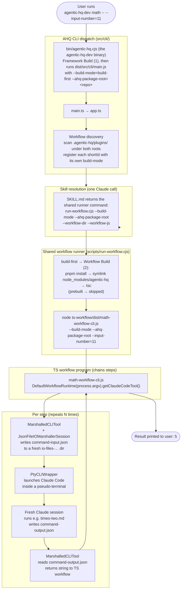

# How Agentic HQ Works

This document explains the core architecture of Agentic HQ and how it chains
fresh Claude Code sessions together to drive automated workflows.

For the user-facing tour (what to install, what to run), see the top-level
[`README.md`](../../README.md). This doc is for people working on the AHQ
codebase or building their own workflows.

For definitions of terms used here (workflow, plugin, skill, command, step,
marshalling, etc.), see the [Glossary](../glossary.md).

---

## Architecture at a glance

The diagram below traces a single run of the **math workflow**, used as a
worked example throughout the rest of this doc. The math workflow takes an
input number, runs three separate Claude Code commands on it (×2, then +3,
then ÷5), and prints the final number — e.g. `11 → 22 → 25 → 5`.

It's the simplest workflow that exercises every layer of AHQ: the two builds,
CLI dispatch, plugin discovery, skill resolution, the shared workflow runner,
and the per-step marshalling loop that hands a value from one fresh Claude
session to the next.



The rest of this doc walks through each layer. (From an npm-installed
agentic-hq the picture is the same with the dev binary replaced by `agentic-hq`,
no Framework Build — the package arrives built — and, for a bundled workflow,
`build-mode=prebuilt` so the runner skips the Workflow Build too. See
[Builds: Framework Build (1) and Workflow Build (2)](#builds-framework-build-1-and-workflow-build-2).)

---

## Core Concept

Agentic HQ is a thin TypeScript wrapper around [Claude Code](https://claude.ai/code).
A workflow is a TypeScript program that **chains together multiple Claude Code
sessions** by invoking custom slash commands and passing the output of one as
the input to the next.

Three things make this work:

1. **Claude Code can be scripted via slash commands** — markdown files that
   tell Claude exactly what to do for one step.
2. **Each step runs in a fresh Claude session** — context stays focused;
   no compaction surprises.
3. **Inter-step communication is file-based** — input and output are JSON
   files in a temp directory, so steps are debuggable and a workflow could in
   future be paused and resumed.

---

## Plugin Layout

Workflows ship as **plugins** under `.agentic-hq/plugins/`. Each plugin is a
self-contained directory of skills (the workflow code) and commands (the
per-step instructions Claude follows).

The `agentic-hq-demos-plugin` is the canonical example. Looking at the
math-workflow:

```
.agentic-hq/plugins/agentic-hq-demos-plugin/
├── .claude-plugin/plugin.json
├── commands/
│   └── math-workflow/
│       ├── times-two.md         ← step instructions (read input, ×2, write output)
│       ├── plus-three.md
│       └── div-five.md
└── skills/
    └── math-workflow/
        ├── ahq-workflow.json    ← workflow metadata (shortId, description, ...)
        ├── SKILL.md             ← entry point that returns the shared-runner command
        └── ts-workflow/         ← the workflow's TS sub-project (standard file set, see "Builds" below)
            ├── src/math-workflow-cli.ts   ← chains the three commands
            ├── package.json     ← commander + dev typescript/@types/node; NO agentic-hq dependency
            ├── tsconfig.json    ← emits src → dist
            ├── .npmrc, pnpm-workspace.yaml, pnpm-lock.yaml, .gitignore
            ├── dist/            ← Workflow Build (2) output (generated, gitignored)
            └── node_modules/    ← incl. the agentic-hq symlink (generated, gitignored)
```

Two files are worth reading directly to see the shape of a plugin:

- [`ahq-workflow.json`](../../.agentic-hq/plugins/agentic-hq-demos-plugin/skills/math-workflow/ahq-workflow.json) —
  declares `shortId: "math"`, the description shown by `agentic-hq list`,
  and `exampleParameters`.
- [`math-workflow-cli.ts`](../../.agentic-hq/plugins/agentic-hq-demos-plugin/skills/math-workflow/ts-workflow/src/math-workflow-cli.ts) —
  the actual orchestrator. About 40 lines.

IMPORTANT: Plugins have been designed/structured using the standard Claude Code [Plugin](https://code.claude.com/docs/en/plugins) format so they can be used within Claude Code. This also means they can be shared using Claude Code [Plugin Marketplaces](https://code.claude.com/docs/en/plugin-marketplaces) (NOTE: This hasn't been done yet, but the basics of it have been tested and work)

---

## The Execution Engine

Execution is split across a small set of single-responsibility classes under
`src/tools/marshalled-io-tools/` and `src/io/`.

> [!NOTE]
> **Terminology Explained**
>
> **Marshalling** here means serialising the input/output of one workflow
> step to and from JSON files on disk so a fresh Claude Code session can
> read it, act on it, and write its result back. Each step's input is
> "marshalled out" to `command-input.json` before Claude is launched, and
> Claude's response is "marshalled in" from `command-output.json` once the
> session ends. Because every step is a separate process talking through
> files (not in-memory objects), steps are independently inspectable and a
> workflow could in future be paused and resumed.

The orchestrator is
[`MarshalledCLITool`](../../src/tools/marshalled-io-tools/marshalled-cli-tool.ts).
Its `execute(command, input)` method does four things and nothing else:

1. Create a marshalling session (a unique temp directory).
2. Write the input as JSON.
3. Run the CLI (Claude Code) so it processes that directory.
4. Read the JSON output back.

Most workflow code never touches `MarshalledCLITool` directly — it uses
[`DefaultClaudeCodeTool`](../../src/tools/marshalled-io-tools/claude-code/default-claude-code-tool.ts),
a pre-wired wrapper that pulls `ClaudeCommandBuilder`,
`IOMarshallerSessionFactory`, and the `CLIWrapper` from `CompositionRoot`.

### The file layout, per step

[`JsonFileIOMarshallerSession`](../../src/io/marshalling/json-file-io-marshaller-session.ts)
owns the on-disk shape. For each `execute()` call it creates:

```
.agentic-hq/temp/command-input-output-files/
└── io-files-<timestamp>_<uuid>/
    ├── command-input.json    { "command-input-string": "<input>" }
    └── command-output.json   { "command-output-string": "<output>" }
```

The session directory's path doubles as the **marshalling ID** — the
argument passed to the slash command so Claude knows where to read/write.

### Why PTY?

The Claude Code CLI behaves differently depending on whether it thinks a human
is sitting in front of it. It asks the operating system "is my output
connected to a terminal?" (the `isatty()` check) and only streams its full
output when the answer is *yes*. If the answer is *no* — for example because
its output is being captured by another program — it stays silent.

The simplest way to launch a child process from Node — `child_process.spawn`
with piped stdio — fails that check, because piped stdio is *not* a terminal.
The result is a Claude session that runs but produces nothing for AHQ to
read.

[`PtyCLIWrapper`](../../src/io/terminal/pty-cli-wrapper.ts) gets around this
by using [`node-pty`](https://github.com/microsoft/node-pty) to spawn the CLI
inside a **pseudo-terminal** (PTY) — a virtual terminal device that looks
like a real one to any program asking. Claude's `isatty()` check returns
*yes*, the CLI streams its full output as normal, and AHQ captures it from
the other end of the PTY.

---

## Builds: Framework Build (1) and Workflow Build (2)

AHQ has **two separate builds with two separate owners**, and the same
workflow files build and run identically whether the workflow is bundled inside
the AHQ package or lives in your own workspace. The terms below are the
standard names (also in the [Glossary](../glossary.md#builds--running)); the
AHQ-201 design docs that introduced the split call them "Build 1"/"Build 2".

### Framework Build (1)

Compiles the framework's own `src/` into `<AHQ package root>/dist/` — JS,
`.d.ts` (so workflow code can type-check against it) and source maps — via
`tsconfig.build.json`. Owned only by the framework's entry points: the dev
binary **`agentic-hq-dev`** runs it on every invocation (incremental `tsc`,
about a second once warm) before running the compiled CLI, and the release
build (`pnpm build`) runs it when publishing. It **never runs on a user's
machine**: an npm-installed package arrives with `dist/` already built.

### Workflow Build (2)

Compiles *one workflow's* `ts-workflow/src/` into that workflow's own
`ts-workflow/dist/`, by one shared script that is identical for every workflow
wherever it lives — `scripts/build-workflow.cjs --workflow-dir=<…/ts-workflow> --ahq-package-root=<root>`:

1. `pnpm install` in the workflow dir (`typescript`, `@types/node`,
   `commander` — frozen lockfile; a no-op after the first run);
2. ensure `node_modules/agentic-hq → <ahq-package-root>` — a symlink made from
   the explicit parameter, never from an env var or a depth-relative `link:`
   (always after the install, which would otherwise prune it);
3. `tsc -p tsconfig.json` → `dist/<name>-cli.js`, type-checked against the
   framework through that symlink. A type error stops here, loudly.

Everything it writes stays inside the workflow's `ts-workflow/`; nothing is
ever written into the AHQ package. It is run by the shared runner when
`build-mode` is `build-first`, and by the release build for each bundled
workflow.

**Why "(1)" and "(2)"?** They mark *dependency order*: a Workflow Build always
compiles against the output of a Framework Build that has already happened
(moments earlier, in a clone; at publish time, for an npm install). They are
**not** a promise that both run every time — `agentic-hq-dev list` runs only
the Framework Build; a workspace workflow launched from an npm install runs
only the Workflow Build; a bundled workflow run from an npm install runs
neither.

### `build-mode` — the mode of the workflow being launched

`build-first` means "run the Workflow Build, then run the workflow";
`prebuilt` means "just run it". The CLI sets it per workflow from **which root
it discovered the workflow under** — where it lives *is* its mode:

| Workflow discovered under | `build-mode` |
| --- | --- |
| your local workspace (`<cwd>/.agentic-hq/plugins/…`) | `build-first` — a workspace holds source |
| the AHQ package (`<ahq-package-root>/.agentic-hq/plugins/…`) | the binary's mode: `build-first` under `agentic-hq-dev`, `prebuilt` under the npm-installed `agentic-hq` |

It is relayed verbatim across the Claude/skill hop (`$1`), forwarded to the
workflow program, and acted on by exactly one piece of code — the shared
runner. No literal mode appears in any `SKILL.md`; no environment variables are
involved. (In code: `Workspace.getBuildMode()`, carried on each discovered
`AhqWorkflow`, modelled by the `BuildMode` value object.)

### The shared workflow runner (`scripts/run-workflow.cjs`)

Every workflow's `SKILL.md` is **byte-identical**: it takes `skill-id` from the
final path segment of the `skill-base-dir` Claude Code hands every skill (the
skill directory name, which is the `skillId` in `ahq-workflow.json`), names the
program by the standard convention `workflow-program-name = {skill-id}-cli`
(`src/<skill-id>-cli.ts`, compiled to `dist/<skill-id>-cli.js`), and returns the
same command:

```
node "{ahq-package-root}/scripts/run-workflow.cjs" --ahq-package-root="{ahq-package-root}" --build-mode={build-mode} \
     --workflow-dir="{skill-base-dir}/ts-workflow" --workflow-js=dist/{workflow-program-name}.js
```

`--ahq-package-root` and `--build-mode` are the two chain variables, relayed
verbatim and forwarded on to the workflow program; `--workflow-dir` (from the
skill's own directory) and `--workflow-js` (relative to it) are runner-local.
All four are required, with loud errors and no defaults. `build-first` → run
the Workflow Build on `--workflow-dir`, then run; `prebuilt` → run. The runner
never builds the framework and never executes from the staged release tree.

### How the compiled workflow finds the framework

The compiled workflow JS says `import … from 'agentic-hq/tools/claude-code'`.
After a Workflow Build, `node_modules/agentic-hq` is the symlink to the AHQ
package root, whose `package.json` `exports` points at `dist/…/index.js`
(Node follows the symlink to the real path, so the framework's own
dependencies load from the package's `node_modules`). In a prebuilt npm
install, where a bundled workflow's `ts-workflow/` ships with no `node_modules`
and no `package.json`, the import resolves by **Node package self-reference**
against the package's own manifest — which is why the release strips the
per-workflow install files.

### The four combinations

| | Workflow **bundled** in the AHQ package | Workflow in **your workspace** |
| --- | --- | --- |
| **npm-installed** `agentic-hq` | `prebuilt`: nothing built; runs the shipped `ts-workflow/dist/` | `build-first`: Workflow Build (2) in your workflow dir; symlink → the install |
| **cloned** `agentic-hq-dev` | `build-first`: Framework Build (1) by the binary; Workflow Build (2) in the repo's own skill dir | `build-first`: Framework Build (1) by the binary; Workflow Build (2) in your workflow dir; symlink → the clone |

Each combination is worked through hop by hop — directories, the values of all
four runner options, what is built where, and how the framework is resolved —
in [The Four Combinations Of Example Run Types, All Explained And Worked Through](../tickets/AHQ-201/workflow-files/supporting-docs/03-the-four-combinations-of-example-runs-types-all-explained-and-worked-through.md)
(AHQ-201 supporting doc 03; §7 covers the variants — npx, cwd inside the
clone, a collaborator's machine — and §8 records why all four runner options
were kept).

### The two roots

Every combination above resolves against exactly two directories:

- **The AHQ package root** (`ahq-package-root`) — the directory the executing
  copy of Agentic HQ lives in. It is always one of exactly two places: the
  root of the `agentic-hq` package in the npm installation directory, or the
  root of a checked-out Agentic HQ repo workspace. It holds the framework
  code, the shared runner, and the bundled plugins — arriving prebuilt in the
  npm package, but compiled at run time in a checkout (the Framework Build on
  every `agentic-hq-dev` invocation, the Workflow Build per `build-first`
  workflow). Never detected or guessed: each bin wrapper passes its own
  parent directory, so which copy runs is set structurally by which binary
  you invoked.
- **The local workspace** — your current directory when you run a workflow.
  Your own plugins are discovered here, per-run temp files are written here,
  and Claude itself is launched in the root of this workspace.

The two overlap when you run from the root of a clone of the AHQ repo: that
one directory is then both roots at once, and the CLI searches it once rather
than twice (`agentic-hq list` shows `Same as Agentic HQ Package` in place of a
repeated block).

### The two binaries and the staged release tree

- **`agentic-hq-dev`** — the clone's binary (`bin/agentic-hq.cjs`, on PATH via
  `npm link`): Framework Build, then the compiled CLI, `build-mode=build-first`.
  Edit code or workflow files and run; there is no build step to remember.
- **`agentic-hq`** — the npm-installed package's binary
  (`bin/agentic-hq-prebuilt.cjs`): runs the compiled CLI, `build-mode=prebuilt`.
- **`release/`** — assembled by `pnpm build` (`scripts/build-release.cjs`):
  Framework Build → Workflow Build for each bundled workflow → stage exactly
  what ships (generated manifest, prebuilt bin wrapper, the runner and
  workflow-build scripts, `dist/`, the shipped plugins with their
  `ts-workflow/dist/` and without install files or `node_modules`,
  README/LICENSE). Publish-only — `cd release && pnpm pack`; no dev run ever
  executes from it. See [publish-checklist.md](publish-checklist.md).

---

## CLI Dispatch

How does `agentic-hq-dev math -- --input-number=11` reach the right plugin?

1. **`bin/agentic-hq.cjs`** (the `agentic-hq-dev` binary) — CJS shim. Runs
   the Framework Build (1), then runs the compiled `dist/src/cli/main.js` with
   the explicit `--build-mode=build-first --ahq-package-root=<repo>` options
   inserted ahead of your arguments (the npm-installed `agentic-hq` binary does
   the same minus the build, with `--build-mode=prebuilt`).
2. **[`src/cli/main.ts`](../../src/cli/main.ts)** — two lines:
   `import { app }; app.run();`. Deliberately tiny; see *Transitional design
   notes* below.
3. **[`src/cli/app.ts`](../../src/cli/app.ts)** — bootstrap. Constructs
   `CompositionRoot`, asks it for a `WorkflowCommandBuilder`, and hands both
   builder and a fresh `WorkflowSearchResultsImpl` to `createProgram(...)`.
4. **[`src/cli/agentic-hq-program.ts`](../../src/cli/agentic-hq-program.ts)** —
   sets up Commander.js, then asks the search results to register a
   subcommand for every discovered workflow.
5. **[`src/cli/workflow-registry-impl.ts`](../../src/cli/workflow-registry-impl.ts)** —
   for each workflow, registers the `shortId` as a Commander subcommand
   whose action delegates to the workflow command builder, passing along the
   workflow's own `build-mode` (set from the root it was discovered under —
   see [`build-mode`](#build-mode--the-mode-of-the-workflow-being-launched)).
   The first registration of a `shortId` wins (the local workspace registers
   before the AHQ package, so a local workflow shadows a shipped one with the
   same `shortId`); later ones are not registered and `agentic-hq list` shows
   them flagged `DISABLED`.

### Workflow discovery

The chain that finds workflows on disk:

- [`WorkspaceImpl`](../../src/workflow-discovery/workspace/workspace-impl.ts)
  scans `.agentic-hq/plugins/`.
- For each plugin,
  [`PluginDirectoryImpl`](../../src/workflow-discovery/plugin/plugin-directory-impl.ts)
  globs `skills/*/ahq-workflow.json`.
- Each match is wrapped as an `AhqWorkflowImpl`, exposing `shortId`,
  `description`, and the path to the skill that drives it.

So adding a new workflow is just: drop a plugin directory under
`.agentic-hq/plugins/`, give it a `skills/<name>/ahq-workflow.json`, and the
CLI picks it up automatically.

---

## Worked Example: The Math Workflow

End-to-end trace of `agentic-hq-dev math -- --input-number=11` from the clone:

1. **CLI dispatch** — the `agentic-hq-dev` binary runs the Framework Build (1)
   and the compiled CLI; Commander matches `math` to the math-workflow's
   `shortId`. The action calls
   `builder.build("/agentic-hq-demos-plugin:math-workflow", BuildMode.BUILD_FIRST, ["--input-number=11"])`
   — `build-first` because math-workflow was discovered under the AHQ package
   and this binary's mode is `build-first`.
2. **Skill resolution (two-call pattern)** — The builder calls
   `tool.execute("/agentic-hq-demos-plugin:math-workflow", ...)`, a Claude
   session whose command line ends `<io-dir> build-first <repo>`. Claude reads
   [`SKILL.md`](../../.agentic-hq/plugins/agentic-hq-demos-plugin/skills/math-workflow/SKILL.md),
   which relays those two values verbatim into a `command-output.json` holding
   the **shared runner command**:
   `node "<repo>/scripts/run-workflow.cjs" --ahq-package-root="<repo>" --build-mode=build-first --workflow-dir="<skill>/ts-workflow" --workflow-js=dist/math-workflow-cli.js`.
3. **Run the TS workflow** — That command is executed via the same PTY
   wrapper, with the original `--input-number=11` appended. The runner sees
   `build-first`, runs the Workflow Build (2) in `<skill>/ts-workflow/`
   (install → symlink `node_modules/agentic-hq → <repo>` → `tsc` →
   `dist/math-workflow-cli.js`), then runs
   `node dist/math-workflow-cli.js --build-mode=build-first --ahq-package-root=<repo> --input-number=11`.
4. **Three chained Claude calls** — Inside
   [`math-workflow-cli.ts`](../../.agentic-hq/plugins/agentic-hq-demos-plugin/skills/math-workflow/ts-workflow/src/math-workflow-cli.ts),
   `DefaultWorkflowRuntime` consumes the two framework options from `argv` and
   hands back a wired tool and the workflow's own args:

   ```ts
   const runtime = new DefaultWorkflowRuntime(process.argv);
   const tool = runtime.getClaudeCodeTool();

   const step1 = await tool.execute(
     '/agentic-hq-demos-plugin:math-workflow:times-two', '11');     // → "22"
   const step2 = await tool.execute(
     '/agentic-hq-demos-plugin:math-workflow:plus-three', step1);   // → "25"
   const step3 = await tool.execute(
     '/agentic-hq-demos-plugin:math-workflow:div-five', step2);     // → "5"

   console.log(`Output number: ${step3}`);
   ```

   For each call: a fresh temp `io-files-...` directory is created;
   `command-input.json` is written; Claude runs the matching command
   (e.g. [`times-two.md`](../../.agentic-hq/plugins/agentic-hq-demos-plugin/commands/math-workflow/times-two.md)),
   which reads the input, does the math, and writes
   `command-output.json`; the wrapper reads that file and returns the value
   as a string. Each of those Claude sessions is launched with the same
   `<io-dir> build-first <repo>` relay on its command line (commands ignore
   it; they read `command-input.json`).

5. **Result** — `Output number: 5`.

The temp `io-files-...` directories are kept on disk after the run — handy
for debugging exactly what each step received and produced.

---

## Building Your Own Workflow

To build your own custom workflow run:

```bash
agentic-hq create-workflow
```

This is itself an AHQ workflow. It walks through specifying, scaffolding,
checking, documenting, and human-testing a brand-new workflow end to end. You
can also copy and adapt an existing workflow with `create-workflow -- --using=<short-id>`.
See the [Build Your Own add-feature Workflow](../../README.md#build-your-own-add-feature-workflow)
section of the top-level README for what the experience looks like, or the
[`create-workflow` entry](../user-docs/workflow-descriptions/overview-of-workflows.md#create-workflow--create-a-new-agentic-hq-workflow)
in the workflow catalogue for the full step-by-step.

---

## Key Design Principles

1. **File-based I/O.** Steps communicate via JSON files, not memory. Each
   step is independently inspectable; debug by `cat`ing the temp directory.
   Future workflow resumption is possible without changing the contract.
2. **Fresh context per step.** Every Claude invocation is a new session.
   Steps are kept focused and minimal so that context contains just the 
   required info and compaction is less likely.
3. **Markdown command instructions.** The per-step prompts are markdown
   files in the plugin — version-controlled, reviewable, editable like any
   other code.
4. **Single-responsibility classes.** The execution engine
   (`MarshalledCLITool`, `JsonFileIOMarshallerSession`, `PtyCLIWrapper`,
   `ClaudeCommandBuilder`) has been deliberately split so each piece does
   one thing — see the SRP "Does / Knows About / Knows Nothing About"
   comments at the top of each class.
5. **Thin wrapper.** AHQ doesn't try to replace Claude Code. It provides
   the glue to chain commands and the discovery to make plugins
   pluggable.
6. **Markdown as memory.** The information that needs to flow between each 
   of the steps in a Workflow is kept in focused markdown files.  Each task
   loads only the markdown files it needs to complete its task and writes only 
   what the following agents need to do their work.  AHQ provides
   a structured way to successively compress a large amount of information
   down into exactly what the AI needs to complete a task with maximum 
   reliability and maximum quality.

---

## Transitional Design Notes

A few things in the codebase are *intentionally* shaped the way they are
right now and will change in tracked follow-up tickets. Worth knowing about
so you don't mistake them for permanent design:

- **Two-workspace plugin search.** When the CLI runs, it currently looks
  for plugins in both the AHQ package (where the CLI itself lives) and
  the user's current workspace. See the comments in
  `src/tools/marshalled-io-tools/claude-code/claude-command-builder.ts` —
  this is a temporary "search both" approach pending a proper
  multi-workspace resolution design.
- **Static `DEFAULT_ALLOWED_TOOLS` list.** Auto-approved Claude tools
  (Bash, Edit, Write, Jira/Confluence MCP, etc.) are listed in
  `claude-command-builder.ts`. Per-workflow bundling is tracked in
  [AHQ-102](https://agentic-hq.atlassian.net/browse/AHQ-102).
