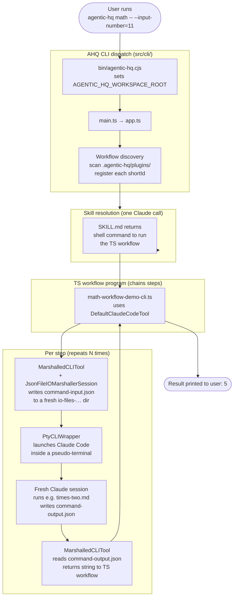

# How Agentic HQ Works

This document explains the core architecture of Agentic HQ and how it chains
fresh Claude Code sessions together to drive automated workflows.

For the user-facing tour (what to install, what to run), see the top-level
[`README.md`](../../README.md). This doc is for people working on the AHQ
codebase or building their own workflows.

For definitions of terms used here (workflow, plugin, skill, command, step,
marshalling, etc.), see the [Glossary](../glossary.md).

---

## Architecture at a glance

The diagram below traces a single run of the **math workflow**, used as a
worked example throughout the rest of this doc. The math workflow takes an
input number, runs three separate Claude Code commands on it (×2, then +3,
then ÷5), and prints the final number — e.g. `11 → 22 → 25 → 5`.

It's the simplest workflow that exercises every layer of AHQ: CLI dispatch,
plugin discovery, skill resolution, and the per-step marshalling loop that
hands a value from one fresh Claude session to the next.



The rest of this doc walks through each layer.

---

## Core Concept

Agentic HQ is a thin TypeScript wrapper around [Claude Code](https://claude.ai/code).
A workflow is a TypeScript program that **chains together multiple Claude Code
sessions** by invoking custom slash commands and passing the output of one as
the input to the next.

Three things make this work:

1. **Claude Code can be scripted via slash commands** — markdown files that
   tell Claude exactly what to do for one step.
2. **Each step runs in a fresh Claude session** — context stays focused;
   no compaction surprises.
3. **Inter-step communication is file-based** — input and output are JSON
   files in a temp directory, so steps are debuggable and a workflow could in
   future be paused and resumed.

---

## Plugin Layout

Workflows ship as **plugins** under `.agentic-hq/plugins/`. Each plugin is a
self-contained directory of skills (the workflow code) and commands (the
per-step instructions Claude follows).

The `agentic-hq-demos-plugin` is the canonical example. Looking at the
math-workflow:

```
.agentic-hq/plugins/agentic-hq-demos-plugin/
├── .claude-plugin/plugin.json
├── commands/
│   └── math-workflow/
│       ├── times-two.md         ← step instructions (read input, ×2, write output)
│       ├── plus-three.md
│       └── div-five.md
└── skills/
    └── math-workflow/
        ├── ahq-workflow.json    ← workflow metadata (shortId, description, ...)
        ├── SKILL.md             ← entry point that returns the shell command
        └── ts-workflow/
            ├── src/math-workflow-demo-cli.ts   ← chains the three commands
            ├── package.json
            └── tsconfig.json
```

Two files are worth reading directly to see the shape of a plugin:

- [`ahq-workflow.json`](../../.agentic-hq/plugins/agentic-hq-demos-plugin/skills/math-workflow/ahq-workflow.json) —
  declares `shortId: "math"`, the description shown by `agentic-hq list`,
  and `exampleParameters`.
- [`math-workflow-demo-cli.ts`](../../.agentic-hq/plugins/agentic-hq-demos-plugin/skills/math-workflow/ts-workflow/src/math-workflow-demo-cli.ts) —
  the actual orchestrator. About 40 lines.

IMPORTANT: Plugins have been designed/structured using the standard Claude Code [Plugin](https://code.claude.com/docs/en/plugins) format so they can be used within Claude Code. This also means they can be shared using Claude Code [Plugin Marketplaces](https://code.claude.com/docs/en/plugin-marketplaces) (NOTE: This hasn't been done yet, but the basics of it have been tested and work)

---

## The Execution Engine

Execution is split across a small set of single-responsibility classes under
`src/tools/marshalled-io-tools/` and `src/io/`.

> [!NOTE]
> **Terminology Explained**
>
> **Marshalling** here means serialising the input/output of one workflow
> step to and from JSON files on disk so a fresh Claude Code session can
> read it, act on it, and write its result back. Each step's input is
> "marshalled out" to `command-input.json` before Claude is launched, and
> Claude's response is "marshalled in" from `command-output.json` once the
> session ends. Because every step is a separate process talking through
> files (not in-memory objects), steps are independently inspectable and a
> workflow could in future be paused and resumed.

The orchestrator is
[`MarshalledCLITool`](../../src/tools/marshalled-io-tools/marshalled-cli-tool.ts).
Its `execute(command, input)` method does four things and nothing else:

1. Create a marshalling session (a unique temp directory).
2. Write the input as JSON.
3. Run the CLI (Claude Code) so it processes that directory.
4. Read the JSON output back.

Most workflow code never touches `MarshalledCLITool` directly — it uses
[`DefaultClaudeCodeTool`](../../src/tools/marshalled-io-tools/claude-code/default-claude-code-tool.ts),
a pre-wired wrapper that pulls `ClaudeCommandBuilder`,
`IOMarshallerSessionFactory`, and the `CLIWrapper` from `CompositionRoot`.

### The file layout, per step

[`JsonFileIOMarshallerSession`](../../src/io/marshalling/json-file-io-marshaller-session.ts)
owns the on-disk shape. For each `execute()` call it creates:

```
.agentic-hq/temp/command-input-output-files/
└── io-files-<timestamp>_<uuid>/
    ├── command-input.json    { "command-input-string": "<input>" }
    └── command-output.json   { "command-output-string": "<output>" }
```

The session directory's path doubles as the **marshalling ID** — the
argument passed to the slash command so Claude knows where to read/write.

### Why PTY?

The Claude Code CLI behaves differently depending on whether it thinks a human
is sitting in front of it. It asks the operating system "is my output
connected to a terminal?" (the `isatty()` check) and only streams its full
output when the answer is *yes*. If the answer is *no* — for example because
its output is being captured by another program — it stays silent.

The simplest way to launch a child process from Node — `child_process.spawn`
with piped stdio — fails that check, because piped stdio is *not* a terminal.
The result is a Claude session that runs but produces nothing for AHQ to
read.

[`PtyCLIWrapper`](../../src/io/terminal/pty-cli-wrapper.ts) gets around this
by using [`node-pty`](https://github.com/microsoft/node-pty) to spawn the CLI
inside a **pseudo-terminal** (PTY) — a virtual terminal device that looks
like a real one to any program asking. Claude's `isatty()` check returns
*yes*, the CLI streams its full output as normal, and AHQ captures it from
the other end of the PTY.

---

## CLI Dispatch

How does `agentic-hq math -- --input-number=11` reach the right plugin?

1. **`bin/agentic-hq.cjs`** — CJS shim. Sets
   `AGENTIC_HQ_WORKSPACE_ROOT` (so workflow discovery can find the plugins
   dir) and execs `tsx src/cli/main.ts`.
2. **[`src/cli/main.ts`](../../src/cli/main.ts)** — two lines:
   `import { app }; app.run();`. Deliberately tiny; see *Transitional design
   notes* below.
3. **[`src/cli/app.ts`](../../src/cli/app.ts)** — bootstrap. Constructs
   `CompositionRoot`, asks it for a `WorkflowCommandBuilder`, and hands both
   builder and a fresh `WorkflowSearchResultsImpl` to `createProgram(...)`.
4. **[`src/cli/agentic-hq-program.ts`](../../src/cli/agentic-hq-program.ts)** —
   sets up Commander.js, then asks the search results to register a
   subcommand for every discovered workflow.
5. **[`src/cli/workflow-registry-impl.ts`](../../src/cli/workflow-registry-impl.ts)** —
   for each workflow, registers the `shortId` as a Commander subcommand
   whose action delegates to the workflow command builder.

### Workflow discovery

The chain that finds workflows on disk:

- [`WorkspaceImpl`](../../src/workflow-discovery/workspace/workspace-impl.ts)
  scans `.agentic-hq/plugins/`.
- For each plugin,
  [`PluginDirectoryImpl`](../../src/workflow-discovery/plugin/plugin-directory-impl.ts)
  globs `skills/*/ahq-workflow.json`.
- Each match is wrapped as an `AhqWorkflowImpl`, exposing `shortId`,
  `description`, and the path to the skill that drives it.

So adding a new workflow is just: drop a plugin directory under
`.agentic-hq/plugins/`, give it a `skills/<name>/ahq-workflow.json`, and the
CLI picks it up automatically.

---

## Worked Example: The Math Workflow

End-to-end trace of `agentic-hq math -- --input-number=11`:

1. **CLI dispatch** — Commander matches `math` to the math-workflow's
   `shortId`. The action calls
   `builder.build("/agentic-hq-demos-plugin:math-workflow", ["--input-number=11"])`.
2. **Skill resolution (two-call pattern)** — The builder calls
   `tool.execute("/agentic-hq-demos-plugin:math-workflow", ...)`. Claude
   reads
   [`SKILL.md`](../../.agentic-hq/plugins/agentic-hq-demos-plugin/skills/math-workflow/SKILL.md),
   which writes a `command-output.json` containing a **shell command string**
   that runs the TypeScript workflow:
   `(cd <skill>/ts-workflow && pnpm install) && tsx <skill>/ts-workflow/src/math-workflow-demo-cli.ts`.
3. **Run the TS workflow** — That shell command is then executed via the
   same PTY wrapper, with the original `--input-number=11` appended.
4. **Three chained Claude calls** — Inside
   [`math-workflow-demo-cli.ts`](../../.agentic-hq/plugins/agentic-hq-demos-plugin/skills/math-workflow/ts-workflow/src/math-workflow-demo-cli.ts):

   ```ts
   const tool = new DefaultClaudeCodeTool();

   const step1 = await tool.execute(
     '/agentic-hq-demos-plugin:math-workflow:times-two', '11');     // → "22"
   const step2 = await tool.execute(
     '/agentic-hq-demos-plugin:math-workflow:plus-three', step1);   // → "25"
   const step3 = await tool.execute(
     '/agentic-hq-demos-plugin:math-workflow:div-five', step2);     // → "5"

   console.log(`Output number: ${step3}`);
   ```

   For each call: a fresh temp `io-files-...` directory is created;
   `command-input.json` is written; Claude runs the matching command
   (e.g. [`times-two.md`](../../.agentic-hq/plugins/agentic-hq-demos-plugin/commands/math-workflow/times-two.md)),
   which reads the input, does the math, and writes
   `command-output.json`; the wrapper reads that file and returns the value
   as a string.

5. **Result** — `Output number: 5`.

The temp `io-files-...` directories are kept on disk after the run — handy
for debugging exactly what each step received and produced.

---

## Building Your Own Workflow

To build your own custom workflow run:

```bash
agentic-hq create-workflow
```

This is itself an AHQ workflow. It walks through specifying, scaffolding,
checking, documenting, and human-testing a brand-new workflow end to end. You
can also copy and adapt an existing workflow with `create-workflow -- --using=<short-id>`.
See the [Build Your Own add-feature Workflow](../../README.md#build-your-own-add-feature-workflow)
section of the top-level README for what the experience looks like, or the
[`create-workflow` entry](../user-docs/workflow-descriptions/overview-of-workflows.md#create-workflow--create-a-new-agentic-hq-workflow)
in the workflow catalogue for the full step-by-step.

---

## Key Design Principles

1. **File-based I/O.** Steps communicate via JSON files, not memory. Each
   step is independently inspectable; debug by `cat`ing the temp directory.
   Future workflow resumption is possible without changing the contract.
2. **Fresh context per step.** Every Claude invocation is a new session.
   Steps are kept focused and minimal so that context contains just the 
   required info and compaction is less likely.
3. **Markdown command instructions.** The per-step prompts are markdown
   files in the plugin — version-controlled, reviewable, edit-able like any
   other code.
4. **Single-responsibility classes.** The execution engine
   (`MarshalledCLITool`, `JsonFileIOMarshallerSession`, `PtyCLIWrapper`,
   `ClaudeCommandBuilder`) has been deliberately split so each piece does
   one thing — see the SRP "Does / Knows About / Knows Nothing About"
   comments at the top of each class.
5. **Thin wrapper.** AHQ doesn't try to replace Claude Code. It provides
   the glue to chain commands and the discovery to make plugins
   pluggable.
6. **Markdown as memory.** The information that needs to flow between each 
   of the steps in a Workflow is kept in focused markdown files.  Each task
   loads only the markdown files it needs to complete its task and writes only 
   what the following agents need to do their work.  AHQ provides
   a structured way to successively compress a large amount of information
   down into exactly what the AI needs to complete a task with maximum 
   reliability and maximum quality.

---

## Transitional Design Notes

A few things in the codebase are *intentionally* shaped the way they are
right now and will change in tracked follow-up tickets. Worth knowing about
so you don't mistake them for permanent design:

- **Two-workspace plugin search.** When the CLI runs, it currently looks
  for plugins in both the AHQ workspace (where the CLI itself lives) and
  the user's current workspace. See the comments in
  `src/tools/marshalled-io-tools/claude-code/claude-command-builder.ts` —
  this is a temporary "search both" approach pending a proper
  multi-workspace resolution design.
- **Static `DEFAULT_ALLOWED_TOOLS` list.** Auto-approved Claude tools
  (Bash, Edit, Write, Jira/Confluence MCP, etc.) are listed in
  `claude-command-builder.ts`. Per-workflow bundling is tracked in
  [AHQ-102](https://agentic-hq.atlassian.net/browse/AHQ-102).
- **Env-var workspace root.** `bin/agentic-hq.cjs` sets
  `AGENTIC_HQ_WORKSPACE_ROOT` so downstream code can find the plugins
  directory. There's a REFACTOR note in that file flagging the env-var
  approach as global hidden state worth replacing with an explicit
  parameter passed inward from the boundary.
