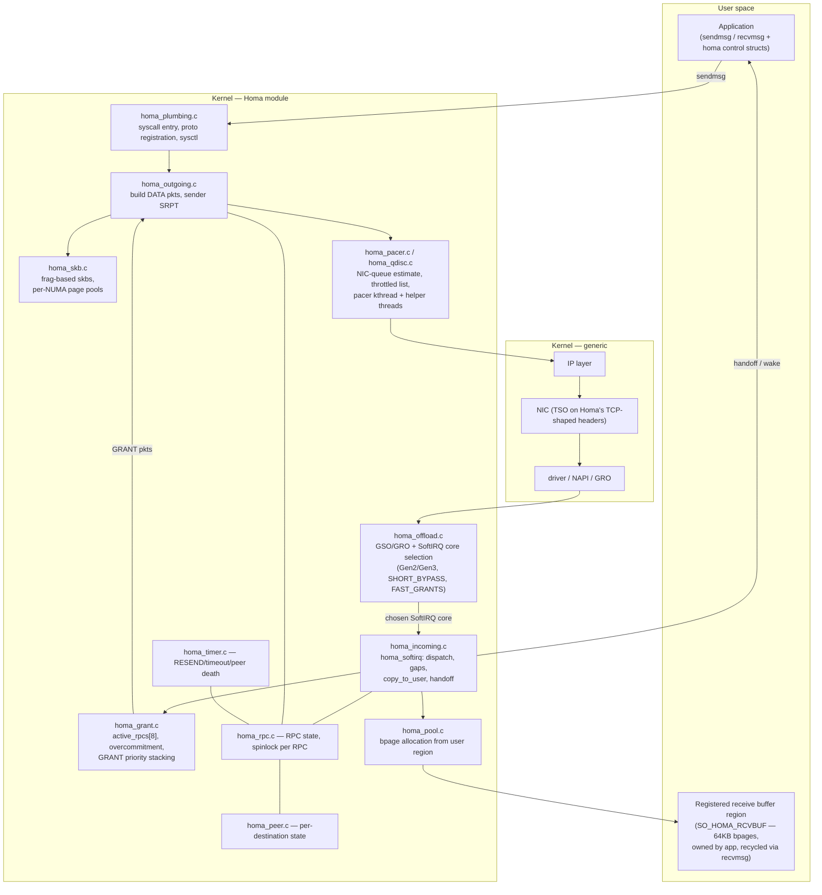

# Homa Linux Module — Detailed Research Document

> Research date: **2026-07-23**. Status claims are date-stamped because Homa's upstreaming status changes month to month — see [How to re-check current status](#15-how-to-re-check-current-status).
>
> Companion summary: [03-homa-summary-research-document.md](03-homa-summary-research-document.md). Working notes and per-topic source dumps live in [supporting-docs/](supporting-docs/).
>
> Reader assumptions (per the research brief): comfortable in C and general programming; basic-but-not-specialist understanding of networking. Section 2 provides the network-stack refresher that the rest of the document builds on.

## Table of contents

0. [Terms explained](#terms-explained)
1. [What is Homa, in one page](#1-what-is-homa-in-one-page)
2. [Refresher: the Linux network stack, and where a transport lives](#2-refresher-the-linux-network-stack-and-where-a-transport-lives)
3. [History and people](#3-history-and-people)
4. [Aims: the case against TCP in the datacenter — and the pushback](#4-aims-the-case-against-tcp-in-the-datacenter--and-the-pushback)
5. [The Homa protocol in detail](#5-the-homa-protocol-in-detail)
6. [Architecture and code deep-dive (HomaModule)](#6-architecture-and-code-deep-dive-homamodule)
7. [Six years of performance engineering: what actually made it fast](#7-six-years-of-performance-engineering-what-actually-made-it-fast)
8. [What Homa makes fast, what it makes slower, and what limits it](#8-what-homa-makes-fast-what-it-makes-slower-and-what-limits-it)
9. [Benchmarks: how success is measured](#9-benchmarks-how-success-is-measured)
10. [Alternatives and their numbers](#10-alternatives-and-their-numbers)
11. [Mechanical sympathy: LMAX-style design in Homa and its alternatives](#11-mechanical-sympathy-lmax-style-design-in-homa-and-its-alternatives)
12. [Upstream status (as of 2026-07-23)](#12-upstream-status-as-of-2026-07-23)
13. [The sociology of upstreaming: what the kernel process does to a research protocol](#13-the-sociology-of-upstreaming-what-the-kernel-process-does-to-a-research-protocol)
14. [Use cases and ecosystem](#14-use-cases-and-ecosystem)
15. [How to re-check current status](#15-how-to-re-check-current-status)
16. [Sources and further reading](#16-sources-and-further-reading)

---

## Terms explained

Reference table for the jargon used throughout this document (requested in the research brief — basics like TCP/IP assumed known). Ordered roughly: measurement → protocol concepts → Linux networking internals → hardware/CPU → the kernel-bypass world → kernel-process terms.

| Term | Meaning |
|---|---|
| **P50 / P99 / P999 / P9999** | Percentiles of a latency distribution. P50 = median (half of all requests were faster). P99 = 99% were faster — i.e. the experience of your *unluckiest 1%* of requests. P999/P9999 = 99.9%/99.99%. P10 (occasionally used) = the *luckiest* 10%. Datacenter work obsesses over high percentiles because one user action fans out into hundreds of RPCs, so "1-in-100 slow" becomes "nearly every user action hits at least one slow RPC". |
| **Tail latency** | The latency at those high percentiles (P99 and beyond) — the "tail" of the distribution. Homa's entire pitch is about the tail, not the average. |
| **RTT** | Round-trip time: send a request, receive the response, total elapsed. "100B RTT ~15µs" means a tiny request+reply completes in 15 microseconds. |
| **Slowdown** | Homa's headline success metric: measured RTT ÷ the best-possible RTT for a message of that size on idle hardware. 1.0 = perfect; a slowdown of 50 means "this message took 50x longer than it would on an empty network". Reported at P50/P99 per message size, under heavy load. |
| **Goodput** | Throughput counting only useful application bytes (excluding headers, retransmissions) — "Gbps of actual data delivered". |
| **CDF** | Cumulative distribution function — "what fraction of samples are ≤ x". How latency/message-size distributions are plotted. |
| **Open-loop / Poisson load** | Benchmark style where requests arrive on a random (Poisson) schedule *regardless of whether earlier ones finished* — like real independent clients. Harsher and more realistic than closed-loop ("wait for reply, then send next"), which self-throttles when the system slows down. |
| **Incast** | Many machines sending to one receiver simultaneously (e.g. a query fanned out to 1000 workers whose replies all arrive at once), overwhelming the receiver's link/buffers. A classic datacenter failure mode. |
| **RPC** | Remote procedure call: one request message from client to server, one response message back. The unit Homa is built around — as opposed to TCP's continuous byte stream with no message boundaries the kernel can see. |
| **SRPT / SRPT-scheduled** | Shortest Remaining Processing Time — always serve the job with the least work left; provably near-optimal for average completion time and great for short jobs. "SRPT-scheduled" = Homa applies this everywhere: the sender transmits its shortest message first, the receiver grants to the shortest incoming message first, and switch priorities let short messages overtake long ones on the wire. Its known dark side: long jobs can starve (Homa reserves a small bandwidth slice for the *oldest* message to prevent this). |
| **Congestion control** | The mechanism deciding how fast to send so the network doesn't drown in queued packets. **Sender-driven** (TCP): sender guesses from signals like loss/delay — it must *create* queues to detect them. **Receiver-driven** (Homa): the receiver explicitly schedules incoming data, since it alone sees everything arriving at its link. |
| **Grants / unscheduled bytes** | Homa's flow control. A sender may blind-transmit the first ~RTT's worth of a message (*unscheduled bytes* — no permission needed, so short messages never wait). Everything after arrives only when the receiver sends a *GRANT* packet ("you may send up to byte X, at priority P"). |
| **BDP (bandwidth-delay product)** | Link speed × round-trip time = how many bytes are "in flight" on the wire when the pipe is full. Sets the natural size for the unscheduled-bytes window (~tens of KB in a datacenter). |
| **Head-of-line (HOL) blocking** | A small urgent item stuck behind a big slow one in the same queue — a 200-byte RPC waiting behind a 1MB transfer on the same TCP stream (or NIC queue). Message-orientation + priorities exist to kill this. |
| **ECMP / flow-consistent routing / packet spraying** | Datacenters have many equal-cost paths between hosts. ECMP hashes each *flow* onto one path (required because TCP hates reordering) — unlucky hash collisions overload one path while others idle. *Packet spraying* = spread individual packets across all paths (needs a reorder-tolerant transport like Homa/SRD). |
| **DSCP / switch priority queues** | Datacenter switches have ~8 egress queues per port, served strict-highest-first; the 6-bit DSCP field in the IP header selects the queue. Homa programs these so short messages jump the queue *inside the network fabric*. |
| **ECN** | Explicit Congestion Notification: switches mark (rather than drop) packets when queues grow; the mark flows back to the sender as a slow-down signal. The mechanism DCTCP is built on. |
| **sk_buff (skb)** | The Linux kernel's packet descriptor — one per packet (or per batch with offloads): a small "linear" header area plus optional page fragments of bulk data. Allocating/copying/freeing skbs is a top cost centre for any transport. |
| **NAPI** | The kernel's interrupt-mitigation receive scheme: on packet arrival the driver switches from interrupts to *polling* the NIC ring until it's drained. Stage 1 of the receive path. |
| **SoftIRQ** | Deferred-interrupt context where the network stack's real receive processing (IP, transport handlers) runs — after NAPI/GRO, possibly on a different core. Stage 2 of the receive path. |
| **TSO / GSO / GRO** | Segmentation offloads. Sending: build one huge (e.g. 64KB) packet, pass it through the stack once, split into wire-size segments in the NIC (**TSO**, hardware) or just before the driver (**GSO**, software). Receiving: merge consecutive packets into one big batch before the stack processes them (**GRO**). Essential for throughput; built around TCP's header format — which is why Homa's header impersonates TCP's. |
| **RSS / RPS / RFS / aRFS** | Ways of choosing which CPU core handles an incoming packet. **RSS**: NIC hashes header fields to pick a receive queue/core (hardware). **RPS**: same idea in software. **RFS**: steer to the core where the consuming *application* runs. **aRFS**: RFS done by the NIC. The whole family exists because one core can't keep up with a fast NIC — and mis-steering is Homa's biggest tail-latency source. |
| **qdisc** | Queuing discipline — Linux's pluggable per-device egress queue/scheduler, sitting between the IP layer and the driver. Homa ships its own (`homa_qdisc`) to keep NIC queues shallow and referee Homa-vs-TCP traffic. |
| **IPI** | Inter-processor interrupt — how one core pokes another ("you have SoftIRQ work"). Costs microseconds when deferred/batched, which Linux does by default. |
| **RCU** | Read-copy-update: kernel synchronisation where readers proceed lock-free and writers publish new versions, freeing old ones only after all readers are done. Powerful, subtle, easy to get wrong — a major theme in Homa's kernel reviews. |
| **Spinlock (vs sleep lock)** | A lock that busy-waits instead of putting the thread to sleep. Mandatory in interrupt/SoftIRQ context (you can't sleep there), so all of Homa's locks are spinlocks — meaning no memory allocation or user-space copying while holding one. |
| **sysctl** | Runtime kernel tuning knobs (`sysctl net.homa.hijack_tcp=1`). Homa exposes ~30 of them. |
| **netns (network namespaces)** | Kernel feature giving containers their own isolated network stack view; a transport must support them to be container-friendly. |
| **Cache line / false sharing** | CPUs move memory in 64-byte cache-line units. If two cores write *different* variables that share a line, the line ping-pongs between cores as if they were contending on one variable ("false sharing") — the classic invisible performance killer; the cure is padding/alignment (`____cacheline_aligned_in_smp` in kernel code). |
| **NUMA** | Non-uniform memory access: multi-socket machines where each CPU has "local" (fast) and "remote" (slower) RAM. Performance code allocates memory on the node that will use it — e.g. Homa's per-NUMA-node page pools. |
| **TLB / hugepages** | The TLB caches virtual→physical address translations; it's small. Hugepages (2MB/1GB instead of 4KB) mean far fewer translations — standard practice in packet processing (DPDK requires them). |
| **C-states** | CPU idle/sleep states. Deeper sleep saves power but costs microseconds to wake from — measurably visible in Homa's latency traces (~2µs C-state exit on one test cluster). |
| **SMI** | System Management Interrupt: firmware-level interrupt that silently freezes *every core* (200–300µs observed) for things like thermal management. Invisible to the OS, and once accounted for about half of Homa's P99 outliers. |
| **TSC / rdtsc / get_cycles()** | The CPU's cycle counter — the cheapest clock (~8ns to read via `rdtsc`; kernel wrapper `get_cycles()`). Kernel networking maintainers ban it (inconsistency risks) in favour of `ktime_get_ns()` (~14ns) — a 6ns difference that matters at 21 million reads/sec. |
| **DDIO** | Intel Data Direct I/O: NIC DMA lands in the CPU's last-level cache instead of RAM — but only ~2 of 11 cache ways by default, a hidden bottleneck near 100 Gbps. |
| **MTU / jumbo frames** | Maximum packet size on the wire. Standard Ethernet: 1500 bytes; *jumbo frames*: up to ~9000. Bigger frames = fewer per-packet costs; Homa's test setups use MTU 3000–9000. |
| **Kernel bypass** | Skipping the kernel entirely: the application drives the NIC from user space (via DPDK, RDMA verbs, etc.). Removes syscalls, SoftIRQ, wakeups — the price is burning dedicated polling cores and losing the kernel's ecosystem (sockets, tooling, isolation). |
| **DPDK** | Data Plane Development Kit: the standard user-space packet-processing framework — takes the NIC away from the kernel, polls it from pinned cores, pre-allocates everything from hugepages. The substrate for eRPC, Seastar's native stack, and the original user-space Homa. |
| **Run-to-completion** | Design where one thread picks up a packet/request and processes it to the end on that core — no handoffs, no queues between stages, no locks. The LMAX philosophy applied to networking; the opposite of the kernel's NAPI→SoftIRQ→wakeup pipeline. |
| **Busy-polling / spinning** | A thread checks for work in a tight loop instead of sleeping and being woken. Saves the ~2.5µs wakeup cost; burns a core. Homa's `recvmsg` spins ~2 RTTs before sleeping as a compromise. |
| **RDMA / verbs / QP** | Remote Direct Memory Access: the NIC implements the reliable transport in hardware; apps post operations ("verbs": send/recv/read/write) on queue pairs (**QP**s) and the NIC DMAs straight into the peer's user memory — ~2µs, no kernel involvement. |
| **InfiniBand / RoCEv2 / iWARP** | The three RDMA carriers. InfiniBand: its own cable/switch ecosystem (HPC heritage). **RoCEv2**: RDMA over ordinary Ethernet/UDP — the datacenter default, but historically demands a *lossless* fabric. iWARP: RDMA over a TCP stack in NIC silicon; lost the market. |
| **PFC / lossless Ethernet** | Priority Flow Control: a switch running out of buffer tells the upstream hop to pause, hop by hop, so packets are never dropped. Sounds great; at scale produces pause storms, congestion spreading, and genuine deadlocks (Microsoft: "yes, it happened!"). What RoCEv2 needed and Homa deliberately avoids needing. |
| **SmartNIC / DPU / IPU** | NICs with substantial compute (ARM cores/ASICs/FPGA) that run infrastructure code — including entire transport protocols — on the card itself: NVIDIA BlueField ("DPU"), Intel E2000 ("IPU", carries Google's Falcon), AWS Nitro (carries SRD). The industry's endgame for the software-overhead problem. |
| **mainline / net-next / linux-next** | Kernel trees: **mainline** = Torvalds' tree, what releases come from; **net-next** = the networking maintainers' staging tree for the *next* release (getting merged here is the real milestone); **linux-next** = daily integration test of everything queued. |
| **netdev** | The Linux kernel networking subsystem's mailing list and community — where Homa's patches are reviewed. Its maintainers: Jakub Kicinski, Paolo Abeni, Eric Dumazet, David Miller. |
| **lore.kernel.org / Patchwork** | The kernel's mailing-list archive (lore) and patch-tracking system (Patchwork — records each series' state: new / changes-requested / accepted). |
| **Acked-by / Reviewed-by** | Formal sign-off tags in kernel patches. A series without any from senior maintainers — Homa's situation after 19 revisions — is not close to merging. |
| **checkpatch / sparse / coccicheck** | The kernel's automated code-hygiene tools (style checker, static analyser, semantic-patch checker). Passing them is table stakes for submission. |
| **LWN** | LWN.net — the journal of record for Linux kernel development; its Homa articles are the best neutral coverage. |
| **CloudLab (xl170 / c6620 / c6525)** | The US academic research testbed where all Homa numbers come from. xl170 = 10-core Intel + 25 Gbps nodes; c6620 = newer Intel + 100 Gbps; c6525-100g = AMD + 100 Gbps. Knowing which cluster a number came from matters when comparing. |

---

## 1. What is Homa, in one page

Homa is a **transport protocol for datacenter networks** — a would-be replacement for TCP for traffic *inside* a datacenter (it is explicitly not intended for the public internet). It was designed at Stanford by John Ousterhout's group, published at [SIGCOMM 2018](https://dl.acm.org/doi/10.1145/3230543.3230564), and since 2019 has existed as a production-quality Linux kernel module ([PlatformLab/HomaModule](https://github.com/PlatformLab/HomaModule), dual BSD/GPL licensed, ~21.6K lines of C as of July 2026). Since October 2024 it has been in the process of being upstreamed into the mainline Linux kernel, with an official IANA IP protocol number (146).

Four design decisions define it:

1. **Messages, not streams.** Homa carries complete request/response messages (up to 1 MB) for RPCs, not byte streams. The kernel knows where each message begins and ends, which eliminates head-of-line blocking at message granularity and lets the *protocol* prioritise whole messages.
2. **Receiver-driven congestion control.** In TCP, the sender guesses how fast to transmit based on congestion signals. In Homa, the *receiver* explicitly schedules incoming data by issuing **grants**. A sender may blindly transmit the first ~RTT's worth of bytes ("unscheduled bytes"); everything after that arrives only as fast as the receiver permits. The receiver is the one place that knows about all incoming traffic, so it can schedule its own downlink precisely.
3. **SRPT — shortest remaining processing time — everywhere.** Homa consistently favours the message with the fewest bytes left. Senders transmit their shortest message first; receivers grant to the shortest incoming messages first; and Homa programs the **priority queues in datacenter switches** (via the DSCP field) so short messages overtake long ones *inside the network fabric*. A small FIFO fraction prevents starvation of large messages.
4. **Connectionless RPCs with at-most-once semantics.** No connection setup, no per-connection state explosion: one socket can talk to any number of peers. An RPC is identified by (client address, id); servers keep state only until the client acks the response.

The payoff is **tail latency**: at high network load with mixed message sizes, Homa's P99 short-message latency is routinely **10–72x better than TCP's** ([measured](https://github.com/PlatformLab/HomaModule/blob/main/perf.txt): e.g. 58µs vs 4.2ms P99 on the W2 workload). The cost is a new API (sendmsg/recvmsg with Homa-specific control structures — existing TCP applications don't just work), a protocol the surrounding ecosystem (load balancers, firewalls, observability) doesn't yet understand, and a multi-year grind through the kernel review process.

---

## 2. Refresher: the Linux network stack, and where a transport lives

*(You can skip this if you know how a packet gets from `send()` to the wire and back.)*

### Sending

```
application
   │  sendmsg() syscall
   ▼
socket layer (struct socket / struct sock — generic plumbing)
   │
   ▼
TRANSPORT protocol (TCP, UDP, ... ← Homa plugs in here)
   │  builds sk_buffs ("skbs" — the kernel's packet descriptor)
   ▼
IP layer (routing decision, IP header)
   │
   ▼
queuing discipline ("qdisc" — per-device egress queue/scheduler)
   │
   ▼
device driver → NIC → wire
```

Key facts the rest of this document leans on:

- **The `sk_buff` (skb)** is the universal currency: one skb ≈ one packet (or one batch, see GSO/GRO below). It has a small "linear" header area plus optional page fragments for bulk data. Allocating, copying and freeing skbs is a major cost centre for any transport.
- **TSO/GSO (segmentation offload), sending side.** Passing a packet through the IP stack costs the same whether it's 1.5 KB or 64 KB, so the stack builds one *huge* packet and splits it into wire-sized segments as late as possible — ideally in the NIC hardware (**TSO**), otherwise in software just before the driver (**GSO**). Without offload, large-message throughput collapses. Crucially, *NIC TSO was built for TCP*: many NICs refuse to segment anything else — a fact that shaped Homa's wire format (§6.6).
- **The receive path runs in three stages, on up to three different cores.** (1) The NIC hashes each packet's headers (**RSS**) to pick a queue/core and raises an interrupt; the driver polls packets off the ring in **NAPI** and merges consecutive ones into batches (**GRO**). (2) The batch is handed to **SoftIRQ** processing — possibly on a different core — where IP and the transport's real receive logic run. (3) The transport wakes the application thread — usually on yet another core, chosen by the Linux scheduler. These three schedulers know nothing about each other; §6.7 and §11 are largely about the tail-latency consequences.
- **A transport protocol module registers itself** with an IP protocol number (Homa's is 146) plus handler tables: a `struct proto` / `proto_ops` for the socket-facing side (what `sendmsg`, `recvmsg`, `poll`, `setsockopt` map to) and a packet handler for the network-facing side. This is exactly what `homa_plumbing.c` does — Homa needs **no changes to the core kernel**; it is a self-contained module, which is what makes out-of-tree distribution feasible.
- **Latency floors, for calibration.** Inside one host, memory-speed messaging (the LMAX Disruptor world, §11) is measured in tens of *nanoseconds*. Across a datacenter network, the NIC + PCIe + switch + wire path puts a hard floor of a few *microseconds* on any RPC: Homa's best-case 100-byte RTT is ~15µs on 25 Gbps hardware (of which ~6µs is NIC-to-NIC network time); kernel TCP under identical best-case conditions is ~23µs. Nothing that stays in the kernel gets to nanoseconds — the interesting fight is µs-scale medians and keeping the P99 from exploding to milliseconds.

---

## 3. History and people

*(Full sourced notes: [supporting-docs/04-why-is-nobody-funding-homa-agent-research-docs/research-history-people-aims.md](supporting-docs/04-why-is-nobody-funding-homa-agent-research-docs/research-history-people-aims.md).)*

### 3.1 The RAMCloud lineage

Homa is the transport-layer descendant of Stanford's **RAMCloud** project (2009–2015), a distributed storage system that kept *all* data in DRAM across thousands of servers and delivered remote reads in **~5µs** ([TOCS 2015](https://dl.acm.org/doi/10.1145/2806887)). The founding manifesto is the May 2011 HotOS paper [**"It's Time for Low Latency"**](https://www.usenix.org/conference/hotosxiii/its-time-low-latency) (Rumble, Ongaro, Stutsman, Rosenblum, Ousterhout): 5–10µs datacenter RPC is physically achievable and the software stack — including the transport — is what stands in the way. When your storage system answers in 5µs, a transport with millisecond tail latency is the problem; Homa is the answer that outlived RAMCloud itself.

### 3.2 The papers

- [**SIGCOMM 2018**](https://dl.acm.org/doi/10.1145/3230543.3230564): "Homa: A Receiver-Driven Low-Latency Transport Protocol Using Network Priorities" — **Behnam Montazeri, Yilong Li, Mohammad Alizadeh (MIT), John Ousterhout** ([complete version on arXiv](https://arxiv.org/abs/1803.09615)). Claimed **P99 RTT < 15µs for short messages at 80% load on 10 Gbps** — "almost 100x lower than the best published measurements of an implementation". The original implementation was **~3,660 lines of C++ inside RAMCloud over DPDK kernel bypass** — a fact that matters for §11.
- [**USENIX ATC 2021**](https://www.usenix.org/conference/atc21/presentation/ousterhout): "A Linux Kernel Implementation of the Homa Transport Protocol" — the kernel-module paper; beats TCP/DCTCP on the same workloads while candidly documenting that Linux itself (core load balancing, the pacer, TCP-shaped kernel assumptions) is now the bottleneck, and musing that transports may ultimately belong in userspace or NICs.
- [**arXiv October 2022**](https://arxiv.org/abs/2210.00714): "It's Time to Replace TCP in the Datacenter" — the position paper / [Netdev 0x16 keynote](https://netdevconf.info/0x16/sessions/keynote/keynote-ousterhout.html) (§4).

### 3.3 The people

**John Ousterhout** (b. 1954; Yale physics '75, CMU CS PhD '80) has one of the more remarkable systems CVs in existence: the **Sprite** network OS and the original **log-structured filesystem** work at Berkeley, the **Magic** VLSI CAD tool, **Tcl/Tk**, co-founder of Scriptics and Electric Cloud, then at Stanford (2008–) **RAMCloud**, co-invention of **Raft** with his PhD student Diego Ongaro, and the book *A Philosophy of Software Design* (2018). Grace Hopper Award, ACM Software System Award, National Academy of Engineering ([Wikipedia](https://en.wikipedia.org/wiki/John_Ousterhout), [Stanford homepage](https://web.stanford.edu/~ouster/cgi-bin/home.php)).

The striking present-day fact: Ousterhout has **retired from teaching (last course Spring 2024), accepts no new students, and states that his current research is "focused primarily around the Homa transport protocol"** — he writes and maintains the ~21K-line kernel module essentially **single-handedly**, in retirement, answering support email personally ([Stanford homepage](https://web.stanford.edu/~ouster/cgi-bin/home.php), [README](https://github.com/PlatformLab/HomaModule/blob/main/README.md)). The perf.txt log (§7) is one person's lab notebook. This is simultaneously the project's greatest strength (coherence, A-Philosophy-of-Software-Design-grade code) and its most obvious sustainability question — kernel maintainers have to ask how it will be maintained for the next 20 years (§13).

Co-authors since moved on: **Montazeri is at Google** (whether his work there relates to Google's Homa-adjacent Falcon transport is not publicly documented), **Alizadeh is at MIT** (the DCTCP/pFabric lineage of congestion control research), **Li** finished the Stanford PhD track. Industry orbit: FPGA house **Missing Link Electronics** presents Homa hardware-acceleration and TCP-coexistence work at SNIA SDC (2023, 2024, and scheduled September 2026); **RHEL 8/9.5 backports** appeared March 2026; no hyperscaler has announced a deployment.

One trivia gap worth noting: **no authoritative source explains the name "Homa"** — the presumed reference is the Persian mythical [Huma bird](https://en.wikipedia.org/wiki/Huma_bird) (lead author Montazeri's heritage), but neither the papers nor the wiki say so.

---

## 4. Aims: the case against TCP in the datacenter — and the pushback

### 4.1 The indictment

The 2022 position paper's thesis is maximal: *"every significant element of TCP, from its stream orientation to its expectation of in-order packet delivery, is wrong for the datacenter"*, and the problems are *"too fundamental and interrelated to be fixed"* ([arXiv:2210.00714](https://arxiv.org/abs/2210.00714); LWN coverage [part 1](https://lwn.net/Articles/913260/), [part 2](https://lwn.net/Articles/914030/)). The five charges:

1. **Stream orientation.** Datacenter apps exchange discrete messages (RPCs); streams add framing work, cause head-of-line blocking, and prevent the NIC/kernel from load-balancing individual messages across threads.
2. **Connection orientation.** Per-connection state (and a socket per peer) is punishing when one service talks to thousands of peers. Homa: connectionless, ~one socket per thread regardless of peer count.
3. **Fair (bandwidth-sharing) scheduling.** "Fairness" means everyone finishes slowly; it is precisely the wrong policy for tail latency. SRPT — run-to-completion, shortest first — is provably better for short messages, and TCP can't express it.
4. **Sender-driven, buffer-filling congestion control.** TCP discovers congestion by *creating* it (queues must build before signals appear). Homa's receiver-driven grants + switch priorities manage the one genuinely scarce resource (receiver downlink) without needing standing queues.
5. **In-order delivery expectation.** Forces flow-consistent ECMP routing → hash collisions → hot core links. Homa tolerates reordering, enabling per-packet spraying.

### 4.2 The pushback, fairly stated

- [**Ivan Pepelnjak** (ipSpace, Jan 2023)](https://blog.ipspace.net/2023/01/data-center-tcp-replacement/): the TCP comparison manufactures head-of-line blocking by multiplexing messages onto a single TCP session ("does not correspond to how TCP is used in most application stacks"); prior art (InfiniBand, RoCE, existing message transports) is ignored; some TCP claims are technically wrong (TCP never *assumed* in-order arrival; fairness is emergent, not designed); core congestion from flow-consistent routing requires "significant bad luck" when server links are 10x slower than core links. Verdict: "can't take Homa seriously based on the arguments made in this position paper" — while conceding the implementation work is solid.
- [**George Michaelson** (APNIC, May 2023)](https://blog.apnic.net/2023/05/22/death-of-tcp-predicted-news-at-11/): history is unkind to special-purpose local protocols (DEC LAT et al.); modern DCs are internally *routed* (BGP-in-the-DC), not the flat fabrics Homa assumes; BBR-style evolution keeps rescuing TCP; deployment gravity is decisive — even QUIC only half-succeeded. Prediction: incremental adaptation, not replacement.
- **Hacker News recurring themes** ([Oct 2022](https://news.ycombinator.com/item?id=33088928), [Nov 2024, 156+ comments](https://news.ycombinator.com/item?id=42168997)): the ecosystem tax (firewalls, LBs, proxies, observability all speak TCP); "only 1% of users have this problem and 1% of those can afford to solve it"; RDMA/RoCE/DCTCP/QUIC already occupy the space; apps must be rewritten for a message API; a suggested DoS vector via grant manipulation. The counterpoint also raised there: **industry is already building receiver-informed, spray-friendly, message-ish transports anyway** — AWS SRD, Google Falcon, the Ultra Ethernet Consortium — which validates Homa's diagnosis while competing with its prescription.
- **No formal academic rebuttal paper exists** as of research date — the debate lives in blogs, HN, and conference Q&A. Notably, most critics attack the *deployability* and the *rhetoric*, not the measured tail-latency results.

---

## 5. The Homa protocol in detail

Everything in this section is taken from the module's own protocol synopsis ([protocol.md](https://github.com/PlatformLab/HomaModule/blob/main/protocol.md)) and the source; this is the protocol as actually implemented, which differs in places from the 2018 paper (the implementation is the authority — the papers are snapshots).

### 5.1 RPCs and messages

Homa implements **RPCs**: a client sends a *request message*, the server processes it and returns a *response message*. Messages are limited to `HOMA_MAX_MESSAGE_LENGTH` = 1 MB ([homa.h](https://github.com/PlatformLab/HomaModule/blob/main/homa.h)). An RPC is identified by a 64-bit id, unique per client machine; the low bit encodes which side you are (client ids are even). There are no connections: a client socket can issue RPCs to any number of servers, and ports 1–32767 are reserved for explicitly-bound servers while ports ≥ 0x8000 are auto-assigned to clients.

### 5.2 Packet types

| Type | Direction | Purpose |
|---|---|---|
| `DATA` | sender → receiver | A range of message bytes + total length + how much will be sent without grants (`incoming`); carries one piggybacked ack slot |
| `GRANT` | receiver → sender | "You may now send bytes up to offset X, at priority P" |
| `RESEND` | receiver → sender | "Retransmit byte range [offset, offset+length)" (receiver-driven loss recovery) |
| `UNKNOWN` | either | "I have no record of this RPC" — triggers client restart of the RPC |
| `BUSY` | sender → receiver | "Alive, but deliberately sending other (higher-priority) traffic" — suppresses timeout |
| `CUTOFFS` | receiver → sender | New priority cutoff table for unscheduled packets |
| `NEED_ACK` / `ACK` | server ↔ client | Reclaim server-side RPC state (at-most-once semantics) |
| `FREEZE` | dev only | Freezes the kernel timetrace for debugging; never upstreamed |

### 5.3 Unscheduled bytes and grants: the receiver-driven core

A sender may transmit the first `unsched_bytes` (historically `rtt_bytes`, ~one bandwidth-delay product; typically tens of KB) of any message **unilaterally**. The idea: by the time those bytes have flowed, the first packet has reached the receiver and a grant has had time to come back — so an unloaded network still runs at full line rate with zero scheduling delay.

Beyond that, data flows only when granted. The receiver maintains, per incoming message, a window of granted-but-not-yet-received bytes, issuing new `GRANT`s as data lands so the pipe stays full. Because the receiver sees *all* of its incoming messages, it can implement SRPT: grants preferentially go to the message with the fewest remaining bytes.

**Overcommitment** is the clever wrinkle. Granting only the single best message would waste downlink whenever that sender stalls (it might be busy sending someone else a shorter message — sender-side SRPT). The module measured **up to 40% of bandwidth wasted** that way. So the receiver grants to up to `max_overcommit` (default 8) messages at once — at most one per sender — bounded by `max_incoming` total outstanding bytes. Grant priorities are stacked: best message gets the highest scheduled priority level, second-best the next, and so on, so if several senders do transmit simultaneously, the switch still delivers them in SRPT order.

### 5.4 Priorities: programming the switches

Homa expects datacenter top-of-rack switches to be configured with **strict priority queues keyed on the top 3 DSCP bits** (IPv4) or top 4 traffic-class bits (IPv6) — up to 8 levels (experience: 4 works about as well). Usage ([protocol.md](https://github.com/PlatformLab/HomaModule/blob/main/protocol.md)):

- **Control packets** (grants, resends, acks): always the highest priority — they're tiny and latency-critical.
- **Scheduled data**: priority assigned "just in time" by the receiver in each GRANT (see stacking above).
- **Unscheduled data**: the sender must pick a priority before any receiver feedback exists. Receivers continuously observe their incoming message-size distribution and compute *cutoffs* — "size < 1 KB → priority 7, < 10 KB → 6, …" — chosen to equalise traffic per level, and push them to senders in `CUTOFFS` packets (versioned; senders keep per-receiver cutoff state). Short messages get the high levels.

The deep point: **priorities exist to reconcile SRPT with buffering**. Homa deliberately keeps some switch buffer occupancy (overcommitment guarantees that) but uses priorities so that a newly-arriving short message *jumps the queue* rather than waiting behind a megabyte already in flight.

### 5.5 Sender-side SRPT and the pacer

The sender mirrors the same policy: among messages with transmittable bytes (granted or unscheduled), always transmit the one with fewest remaining bytes. The enemy is the **NIC queue**: once packets are queued in hardware, a newly-arriving short message is stuck behind them (the NIC is FIFO — priorities only help in the *switches*). So Homa refuses to let deep NIC queues form: it tracks an estimate of bytes handed to the NIC but not yet on the wire, and when that exceeds a threshold (`max_nic_est_backlog_usecs`), packets go to a **throttled list** drained in SRPT order by a dedicated **pacer** kernel thread (§6.8; since Jan 2026, alternatively by a custom qdisc that also manages TCP coexistence).

### 5.6 Loss recovery is receiver-driven — and loss is assumed rare

There are no sender timeouts and no ACK clock. The *receiver* knows what it's expecting; if a message goes quiet too long it sends `RESEND` for the first missing range. A sender that's deliberately serving other messages answers `BUSY` (resetting the timeout) rather than data. If every packet of a request is lost, the client's own quiet-timeout on the response triggers a RESEND, the server answers `UNKNOWN`, and the client restarts the RPC from its unscheduled bytes.

Two overload-aware touches: only **one outstanding RESEND per peer** at a time (rotated across that peer's RPCs), because in a datacenter a timeout much more often means *the peer is overloaded* than *a packet died* — hammering an overloaded peer with retransmit requests makes things worse. And after `timeout_resends` unanswered RESENDs the peer is declared crashed and all of its RPCs are aborted.

### 5.7 At-most-once semantics and state reclamation

Servers must remember completed RPCs until the client confirms receipt of the response, or a retried request could execute twice. Confirmation piggybacks in the ack slot of any later DATA packet to that server; if no traffic flows, the server eventually sends `NEED_ACK` and gets an explicit `ACK` (batching up to 5 acks). Since November 2021 the semantics are strictly at-most-once.

### 5.8 Starvation control

Pure SRPT can starve a huge message forever on a busy network. Homa reserves a small, configurable fraction of grant bandwidth (`fifo_fraction`) and pacer bandwidth (`pacer_fifo_fraction`) for the **oldest** message rather than the shortest. Measured effect under deliberate overload ([perf.txt #60](https://github.com/PlatformLab/HomaModule/blob/main/perf.txt)): P50 slowdown for 1 MB messages improved from ~3093x (no FIFO) to ~1467-1982x — still brutal, but bounded; in practice at sane loads starvation "appears to be very low" even without it.

---

## 6. Architecture and code deep-dive (HomaModule)

Based on reading the source at [PlatformLab/HomaModule](https://github.com/PlatformLab/HomaModule) `main` (cloned 2026-07-23; ~21.6K lines of kernel C plus ~10K of tests and benchmark tools).

### 6.1 The module map

| File | Lines | Role |
|---|---|---|
| `homa_plumbing.c` | 2065 | All Linux glue: protocol registration, syscall entry points, sysctls |
| `homa_qdisc.c` | 1421 | Custom queuing discipline (Jan 2026): pacing + SRPT + TCP coexistence |
| `homa_incoming.c` | 1309 | RX: SoftIRQ handler, packet dispatch, copy-to-user, waiting |
| `homa_grant.c` | 1228 | The grant machinery (receiver-driven scheduling core) |
| `homa_outgoing.c` | 882 | TX: building/sending DATA packets, sender SRPT |
| `homa_rpc.c/.h` | 1530 | RPC objects, lifecycle, lazy reaping |
| `homa_peer.c/.h` | 1139 | Per-destination state (cutoffs, acks, capped cache) |
| `homa_skb.c` | 655 | TX skb memory management: frags + per-NUMA page pools |
| `homa_pool.c` | 597 | RX user-space buffer pool (bpages) |
| `homa_sock.c` | 628 | Socket and socket-table objects |
| `homa_offload.c` | 569 | GSO/GRO + Homa's custom SoftIRQ load balancing |
| `homa_pacer.c/.h` | 522 | Pacer thread (SRPT-preserving NIC queue limiting) |
| `homa_hijack.c` | — | TCP hijacking (send Homa as TCP to get TSO/RSS) |
| `homa_interest.c` | 265 | Bookkeeping for threads waiting in recvmsg |
| `homa_timer.c` | 252 | The tick: RESENDs, timeouts, peer-death detection |
| `homa_metrics.c` | 510 | `/proc/net/homa_metrics` counters |
| `homa_devel.c`, `timetrace.c` | 2281 | Development aids (never to be upstreamed) |



### 6.2 The API: not sockets-as-you-know-them

Homa uses the standard `sendmsg`/`recvmsg` syscalls but with its own semantics, passed via control structures ([homa.h](https://github.com/PlatformLab/HomaModule/blob/main/homa.h)):

- **Send**: `homa_sendmsg_args{id, completion_cookie, flags}`. `id == 0` means "new request" (kernel fills in the new RPC id); nonzero means "this is my response to RPC id". A `HOMA_SENDMSG_PRIVATE` flag marks a request whose response will be awaited specifically (March 2025 API).
- **Receive — the interesting part**: the application pre-registers a chunk of *its own memory* as the socket's receive buffer region (`setsockopt(SO_HOMA_RCVBUF)`). The kernel carves it into 64 KB **bpages**. `recvmsg` doesn't copy into a caller-supplied buffer; it returns *offsets into the registered region* (`bpage_offsets[]`) where the kernel already placed the message, and the app **returns ownership of consumed bpages on its next recvmsg call**. One recvmsg = one whole message (up to 16 bpages). This December 2022 redesign ("v2.0") raised throughput 50–100%: data is copied exactly once (skb→user buffer), copy is pipelined with reception, and buffer management costs no syscalls.
- A socket only receives requests if it opted in via `SO_HOMA_SERVER` (Feb 2025). `HOMAIOCINFO` (Oct 2025) exposes rich per-RPC diagnostics: bytes granted/sent/remaining, gaps, buffer-stall flags — plus an `error_msg` string for the last failure, a distinctly un-kernel-like affordance for debuggability.
- Notable churn signal: `homa_api.c` — a userspace-friendly wrapper library giving `homa_send()`/`homa_reply()` C calls — was **removed in May 2025**; the raw sendmsg/recvmsg interface is now the only API. Expect further change during upstreaming ("The reviewing process is likely to result in API changes" — [README](https://github.com/PlatformLab/HomaModule/blob/main/README.md)).

### 6.3 An RPC's life (sequence view)

```mermaid
sequenceDiagram
    participant CA as Client app
    participant CK as Client kernel (Homa)
    participant SW as Switch (8 priority queues)
    participant SK as Server kernel (Homa)
    participant SA as Server app

    CA->>CK: sendmsg(new request, 1MB)
    Note over CK: SRPT vs other outgoing msgs;<br/>pacer limits NIC queue
    CK->>SW: DATA x N — unscheduled bytes<br/>(priority from CUTOFFS table)
    SW->>SK: DATA (short msgs overtake long ones)
    Note over SK: homa_gro_receive picks SoftIRQ core;<br/>grant machinery ranks this msg vs others
    SK->>SW: GRANT (offset += window, priority P)
    SW->>CK: GRANT (highest priority queue)
    CK->>SW: DATA continues (scheduled, priority P)
    SW->>SK: DATA
    Note over SK: bpages filled from user-registered region;<br/>copy pipelined with arrival
    SK->>SA: recvmsg returns bpage offsets
    SA->>SK: sendmsg(response, id)
    SK->>SW: DATA (response)
    SW->>CK: DATA
    CK->>CA: recvmsg returns response + completion_cookie
    Note over CK,SK: later: client acks piggybacked on next DATA<br/>(or NEED_ACK/ACK) → server frees RPC state
```

### 6.4 Locking: RPC-granularity, and why

The stack's TCP heritage assumes a lock per socket. Homa rejects that with an explicit argument (long design comment in [homa_impl.h](https://github.com/PlatformLab/HomaModule/blob/main/homa_impl.h)): a TCP socket is one connection, so thousands of sockets give natural concurrency; a Homa socket serves *all* of a thread's peers, so a per-socket lock would serialise everything (they tried — it bottlenecked).

- Primary lock: a **spinlock per RPC** (actually per hash-bucket of RPCs). Common-path packet processing touches only its RPC's lock, so different RPCs proceed in parallel even on one socket.
- Lock order is deliberately surprising: **Grant lock → RPC lock → socket lock** — RPC *before* socket, so the common path (which never needs the socket lock) is never forced to take it.
- Everything is a spinlock (SoftIRQ context requires it), so all blocking work (memory allocation, copy to user space) must be hoisted out of critical sections via a take-reference/unlock/work/relock pattern, with revalidation after relocking.
- The performance log shows this evolving under fire: the socket lock was a measured bottleneck in 2019 (fixing double-acquisition raised a small-RPC server from 650 to 760 kops/sec); holding an RPC lock during NIC handoff serialised grant processing (fixed Jan 2023: locks released around `ip_queue_xmit`, +5–10% even on good NICs); SoftIRQ hogging an RPC lock starved copy-out (fixed Feb 2024 with an `APP_NEEDS_LOCK` yield flag, ~+10% on 100G).

### 6.5 TX memory management: the June 2024 frag refactor

Originally each outgoing packet was one contiguous skb allocation. Measured cost at 100 Gbps: **7–9µs per skb allocation, 3.6–4.5 cores** spent allocating ([perf.txt #54](https://github.com/PlatformLab/HomaModule/blob/main/perf.txt)). The redesign in `homa_skb.c`: skb heads now hold only headers; message data lives in **page fragments carved from 64 KB high-order pages**; and freed pages are cached in **per-NUMA-node pools** instead of returning to the kernel allocator (return to Linux is rate-limited via sysctl). Result: 0.85µs per allocation, 0.4–0.5 cores, and goodput-per-core up from ~5.9–7.2 to ~8.4–10 Gbps. This is the single biggest efficiency fix in the module's history — and it's in the *not-yet-upstreamed* pile (§12).

### 6.6 The wire format is a TCP costume

`struct homa_common_hdr` ([homa_wire.h](https://github.com/PlatformLab/HomaModule/blob/main/homa_wire.h)) is bit-for-bit shaped like a TCP header: source/dest ports and the sequence field sit exactly where TCP puts them; Homa's packet type hides in the low byte of TCP's acknowledgment field; `doff`, flags, window, checksum and urgent-pointer slots all exist. Two payoffs:

1. **Free TSO.** Mellanox/NVIDIA NICs will hardware-segment non-TCP packets whose headers look TCP-ish — so Homa gets TSO "out of the box", with real per-segment offsets interleaved into the payload as `homa_seg_hdr`s (TSO replicates the header but won't rewrite Homa's idea of offsets).
2. **TCP hijacking** (July 2024, `homa_hijack.c`) for NICs that check the IP protocol field (e.g. Intel E810): with `sysctl net.homa.hijack_tcp=1`, Homa transmits its packets as *actual TCP* (IP proto 6, valid checksum, magic value 0xb97d in the urgent-pointer slot), and the receiver's Homa module recognises and **steals them back before TCP sees them**. Now TSO *and* RSS work everywhere. The documented caveat: datacenter security middleware that tracks TCP connection legitimacy will drop hijacked packets.

This is a beautifully pragmatic hack — and note the incentive it reveals: *the entire hardware offload ecosystem is TCP-shaped*, so a new protocol must either cosplay as TCP or lose the hardware.

### 6.7 RX path and load balancing: Homa schedules cores, not just packets

An incoming packet crosses up to three cores (NAPI/GRO core ← NIC RSS hash; SoftIRQ core; application core ← Linux scheduler) — three schedulers that don't coordinate. The module's own analysis ([balance.txt](https://github.com/PlatformLab/HomaModule/blob/main/balance.txt)) is blunt: **"hotspots are the primary source of tail latency in Homa"**, and more cores is not always better — on a lightly-loaded node the ideal is *one* core doing everything (no cache migration, no handoff latency).

Homa exploits the one scheduling decision it controls — GRO's choice of SoftIRQ core (`homa_offload.c`, `gro_policy` sysctl):

- **Gen2** (default lineage): scan the next few cores in circular order, avoiding ones with recent GRO activity or pending SoftIRQ backlog. **SHORT_BYPASS**: single-packet messages and **FAST_GRANTS**: grant packets skip the SoftIRQ handoff entirely and are processed inline during GRO (a handoff costs µs; grant turnaround gates throughput) — unless this core is itself too busy (`gro_busy_usecs` guard).
- **Gen3** (Nov 2023): only ¼ of cores run NAPI/GRO; each gets three statically-assigned, non-overlapping SoftIRQ cores; cores where application threads actively use Homa are marked "busy" and avoided; and message handoff prefers waking threads on Homa-quiet cores (each waiting thread records its core in `homa_interest`). Handoff tail latency improved dramatically (GRO→SoftIRQ P99 ~71µs → ~8.7µs) yet **overall workload results barely moved** — a recurring humbling theme in this project's data.

The wider history (2019-2020, [perf.txt](https://github.com/PlatformLab/HomaModule/blob/main/perf.txt) #1/#6/#16/#19/#20/#21): default RSS hashing doesn't understand Homa ports; RPS/RFS actively *hurt* Homa; custom GRO steering bought 20–35% P99 improvement; and some villains are below the OS entirely — System Management Interrupts freezing **all cores simultaneously** for 200–300µs explained about half of 2020's P99 outliers, and Linux's own softirqd priority-inversion produced 5–7ms P999 stalls.

### 6.8 Output pacing: pacer thread → homa_qdisc

The pacer enforces §5.5: `link_idle_time` (an atomic, cacheline-aligned estimate of when the NIC queue drains, from `cycles_per_mbyte` — deliberately overestimated) gates transmission; excess goes to the throttled list, drained in SRPT order by a dedicated kthread. Two war-story-driven refinements: any thread passing a `homa_pacer_check()` callpoint will *help* transmit if the NIC queue is half-empty (a single pacer thread measurably can't keep a fast link busy when it gets descheduled — and making it real-time priority made things *worse*); and the pacer computes its own wakeup time and transmits unconditionally then, guaranteeing progress even while helpers race it.

**homa_qdisc** (Jan 2026, 1421 lines — now the largest new component) moves this logic into a proper Linux queuing discipline that additionally manages **TCP packets on the same host**, because measurement showed the two protocols poison each other's NIC queues: running both together without it inflated Homa's short-message P99 ~4x (379µs vs 98µs standalone on 100G CloudLab); with homa_qdisc, coexistence P99 drops ~3x (to ~125µs), *and TCP itself improves too* — even TCP running alone benefits ([README](https://github.com/PlatformLab/HomaModule/blob/main/README.md), [perf.txt #68](https://github.com/PlatformLab/HomaModule/blob/main/perf.txt)). This matters strategically: "Homa and TCP can share a host gracefully" removes a major real-world deployment objection.

### 6.9 Odds and ends that reveal the design culture

- **Lazy reaping**: freeing a dead RPC's skbs is deliberately deferred and batched (`reap_limit`, `dead_buffs_limit`) to keep deallocation off the latency path — with a 2020 bug story where unpreempted reaping once stalled cores for 10–12ms until `schedule()` calls were sprinkled in.
- **Busy-wait polling in recvmsg** (`poll_usecs`): spin ~2 RTTs before sleeping; saves ~2–4µs per RPC (17.8 → 15.3µs measured), at a real CPU cost (§8).
- **Metrics everywhere**: per-core counters in `/proc/net/homa_metrics`, and a nanosecond-resolution in-kernel ring-buffer **timetrace** with a whole analysis toolchain (`tthoma.py` etc.). Measured overhead of keeping all instrumentation on: ~0.2µs per RPC — they decided it's worth it and left it on.
- The repo carries its own **Wireshark dissector**, cluster-automation scripts for CloudLab, and a script that generates switch priority-queue configuration for Mellanox MLNX-OS.

---

## 7. Six years of performance engineering: what actually made it fast

[perf.txt](https://github.com/PlatformLab/HomaModule/blob/main/perf.txt) is a reverse-chronological log of 71 numbered investigations (2019 → May 2026) — an unusually candid record of what optimising a kernel transport actually looks like. The big arcs:

**Wins that mattered (rough goodput-per-core / latency ledger):**

| Change | When | Effect |
|---|---|---|
| RPC-level locks replace socket locks | Nov 2019 | Removed the central contention point |
| Custom GRO→SoftIRQ core steering | 2020 | −20–35% P99 vs default RSS |
| Busy-wait polling before sleep | Jun 2020 | 100B RTT 17.8 → 15.3µs |
| v2.0 user-registered buffer pool + incremental copy-out | Dec 2022 | +50–100% throughput; rx-side single-flow 21.5 → 42–45 Gbps |
| Pipelining copy-from-user with transmission | Jan 2023 | Single-flow 11 → 17–19 Gbps |
| Explicit IPI flush after GRO handoff | Feb 2024 | Handoff-latency 79 → 46µs; ~+10% throughput |
| skb frags + per-NUMA page pools | Jun 2024 | Alloc 7–9µs → 0.85µs; ~3 cores reclaimed; +~40% goodput/core |
| TCP hijacking (TSO/RSS everywhere) | Jul 2024 | Enables hardware segmentation on Intel NICs |
| homa_qdisc | Jan 2026 | TCP-coexistence P99 ~3x better; TCP improves too |

**Recurring lessons, in their own data:**

1. **The protocol is rarely the bottleneck; the platform is.** Memory allocation, cache misses, core scheduling, IPIs, clock reads, NIC quirks — that's where the microseconds went. (Direct echo of the ATC'21 paper's thesis.)
2. **Measure-first culture.** Several "obviously good" ideas were implemented, measured, and *removed*: kmem_cache for RPCs (slower than kmalloc: 400 vs 378 cycles/alloc), aggressive fast retries (20x retransmit inflation), adaptive polling (complexity ≫ benefit), a dedicated NIC queue for pacer traffic (NIC round-robins queues → self-sabotage), `skb_attempt_defer_free` (moved cost, didn't cut it).
3. **The 100 Gbps wall is memory and NICs, not protocol.** On AMD/100G clusters the NIC itself can't always sustain line rate; 0.5–1 MB backlogs form *inside the NIC* for ≥1ms, and at that point **"priorities don't make a significant difference in latency"** — the switch-priority machinery is neutralised by a dumb FIFO in your own NIC. Memory bandwidth, not per-packet CPU, sets the ceiling (Homa peaked at 72–75 Gbps on W4 vs TCP's 78–79 there).
4. **Hardware and kernel versions move the numbers as much as design does.** Intel vs AMD hosts: 14.5 vs 23.2µs for the same 100B RPC. Kernel 4.15 → 5.4 → 5.17: best-case RTT regressed 12.6 → 15.1 → 15.8µs with Homa's code unchanged. C-state exit latency, SMI firmware pauses, NIC page-cache sizing — all show up at P99.

---

## 8. What Homa makes fast, what it makes slower, and what limits it

**Dramatically better: small-message tail latency under mixed load.** The canonical measurement (40-node xl170 cluster, 25 Gbps, high load, Jan 2021, [perf.txt #31](https://github.com/PlatformLab/HomaModule/blob/main/perf.txt)) — small-message latency in µs:

| Workload | Homa P50 | Homa P99 | TCP P50 | TCP P99 | DCTCP P99 |
|---|---|---|---|---|---|
| W2 | 30.9 | 57.7 | 108.8 (3.5x) | 4151 (72x) | 4812 (83x) |
| W3 | 41.9 | 98.5 | 192.7 (4.6x) | 5093 (52x) | 6362 (65x) |
| W4 | 46.8 | 109.3 | 353.1 (7.5x) | 2113 (19x) | 881 (8x) |
| W5 | 55.4 | 139.0 | 385.7 (6.9x) | 4361 (31x) | 991 (7x) |

Current-hardware snapshot (100 Gbps c6620, Jan 2026): Homa average slowdown 3.3, short-message P99 ~90–98µs; TCP 10.8–11.8 and 832–1272µs. Homa's P99 is typically better than TCP's *mean*. Also notable: Homa's latency CDF barely moves as load rises, whereas TCP's degrades continuously.

**Similar or worse:**

- **Peak bulk throughput**: at 100 Gbps Homa hit 72–75 Gbps on W4 where TCP reached 78–79 — decades of TSO-first engineering favour streams (and Homa's 1 MB message cap means huge transfers are the application's problem).
- **CPU cost with polling on**: busy-wait polling burns 2–3 extra cores; with polling off, Homa's CPU use is slightly *below* TCP's — a genuine latency-vs-efficiency dial ([perf.txt #63](https://github.com/PlatformLab/HomaModule/blob/main/perf.txt)).
- **Best-case (unloaded) latency**: only modestly better than TCP (~15 vs ~23µs), and "best case almost never occurs" — under any real load every software stage runs ~2x slower and P10 lands at 25–30µs.
- **Large-message starvation risk under overload** is real (SRPT's dark side), bounded by the FIFO fraction (§5.8).

**Deployment constraints:** benefits shrink without switch priority queues (though NIC-queue effects, not switch queues, often dominate at 100G anyway); needs TSO cooperation (Mellanox native, Intel via hijacking/DDP); apps must adopt a message API; max message 1 MB; IPv4/IPv6 both supported; network namespaces yes (May 2025), but no per-peer RTT adaptation yet.

---

## 9. Benchmarks: how success is measured

### 9.1 The philosophy

The Homa project's success metric is **not** raw messages-per-second — it's **slowdown**: *RTT divided by the best-case RTT for a message of that size on idle hardware*, reported at P50/P99 across message sizes, **under sustained high network load** (typically 80% of link bandwidth). This deliberately punishes exactly what datacenter operators care about: how much worse things get for *small* RPCs when the network is busy with everyone else's traffic. A perfect transport scores 1.0 everywhere.

### 9.2 Workloads

Five open-loop Poisson workloads **W1–W5**, with message sizes drawn from distributions measured in production datacenters (W1 ≈ tiny-message-dominated … W5 ≈ heavy-tailed with messages to 1 MB; W4/W5 derive from published Facebook/Google traces). Small messages dominate *counts* while large ones dominate *bytes* — the mix that makes SRPT matter.

### 9.3 The tools (all in [util/](https://github.com/PlatformLab/HomaModule/tree/main/util))

- **`cp_node`** — the workhorse client/server: `cp_node server` + `cp_node client --workload W4` (or a fixed size for throughput tests) on cluster nodes.
- **`cp_vs_tcp`** — the headline benchmark: same workload over Homa and TCP (and/or DCTCP), producing slowdown-vs-message-size curves (Figures 3–4 of the ATC'21 paper). Example: `cp_vs_tcp -n 10 -w w4 -b 20` = 10 nodes, W4, 20 Gbps offered (80% of 25 Gbps).
- **`cp_both`** — Homa and TCP *simultaneously* (the coexistence benchmark that motivated homa_qdisc); plus `cp_load`, `cp_mtu`, `cp_config` (parameter sweeps), `cp_basic`.
- **Introspection**: `/proc/net/homa_metrics` (+`metrics.py` diffing), the in-kernel timetrace with `tthoma.py` analysis (per-stage latency breakdowns across NAPI→GRO→SoftIRQ→app), `smi.py` for firmware-pause detection, a Wireshark dissector.

### 9.4 Reproducing (what a future task would need)

A multi-node Linux cluster (papers use CloudLab xl170 25 Gbps Intel / c6620 100 Gbps / c6525-100g AMD), `make all && sudo insmod homa.ko`, then per [INSTALL.md](https://github.com/PlatformLab/HomaModule/blob/main/INSTALL.md): jumbo frames end-to-end, NIC interrupt coalescing off, RPS/RFS on, homa_qdisc per tx queue, switch DSCP strict-priority queues, TSO via Mellanox-native or `hijack_tcp=1`. Expected reference results: the tables in §8. Single-machine or macOS runs are meaningless for this protocol — its whole value proposition is behaviour under multi-host contention.

### 9.5 What "success" should mean for the kernel project

Given §8, sensible acceptance criteria for "Homa in Linux succeeded" are: (a) P99 short-message slowdown at 80% load ≤ a few units where TCP shows tens-to-hundreds; (b) no regression of Homa P99 beyond ~1.3x when TCP shares the host (homa_qdisc's current result); (c) CPU-per-Gbps no worse than TCP with polling off; (d) large-message P99 bounded (FIFO fraction working); (e) — the one outside the repo's control — an ecosystem answer for load balancers/observability. Raw msgs/sec-per-core comparisons belong to the kernel-bypass world (§10, §11), which plays a different game.

---

## 10. Alternatives and their numbers

*(Full sourced notes with per-claim links and measurement context: [supporting-docs/04-why-is-nobody-funding-homa-agent-research-docs/research-alternatives-benchmarks.md](supporting-docs/04-why-is-nobody-funding-homa-agent-research-docs/research-alternatives-benchmarks.md). Every number below carries its context in that file — year, hardware, message size — because numbers without context are meaningless in this space.)*

### 10.1 The contenders at a glance

| Technology | Small-RPC latency | Msgs/sec | Deployment cost | The catch |
|---|---|---|---|---|
| **Kernel TCP** (incumbent) | ~23.4µs best-case 100B RTT; P99 at load: **milliseconds** | ~1M small RPCs/sec/*node* ([ATC'21](https://www.usenix.org/system/files/atc21-ousterhout.pdf)) | Zero — it's everywhere | Streams, connections, fair-sharing, buffer-filling CC → catastrophic tails under mixed load |
| **DCTCP** ([SIGCOMM'10](https://dl.acm.org/doi/10.1145/1851182.1851192)) | Fixes queue occupancy, **not** short-message tails: Homa P99 still 7–83x lower | — | ECN on switches + sysctl | Still TCP in every structural way |
| **BBR** | Wrong layer: WAN/edge congestion control | — | — | Irrelevant to DC RPC tails; Google's DC answer was TIMELY/Swift, not BBR |
| **RDMA verbs** (IB/RoCEv2) | **1.7–2.9µs** ([eRPC Table 2](https://www.usenix.org/conference/nsdi19/presentation/kalia)) | ConnectX-7 datasheet: **330–370M msgs/sec** (hardware verbs rate) | RDMA NICs; for RoCEv2 historically PFC lossless fabric + DCQCN | [Microsoft's war stories](https://www.microsoft.com/en-us/research/wp-content/uploads/2016/11/rdma_sigcomm2016.pdf): PFC deadlocks ("yes, it happened!"), pause storms, livelock; per-QP streams reintroduce HOL blocking (~1000x tails in RAMCloud's test) |
| **AWS SRD/EFA** ([IEEE Micro '20](https://ieeexplore.ieee.org/document/9167399/)) | ~15.5µs MPI ping-pong (marketing-sourced) | — | Only exists on AWS Nitro | Multipath spraying + out-of-order delivery in the NIC — Homa's diagnosis, Amazon's prescription |
| **eRPC** ([NSDI'19](https://www.usenix.org/conference/nsdi19/presentation/kalia), best paper) | **2.3µs median**; 99.99th < 700µs at 100 nodes | **~10M RPCs/sec/core**; 75 Gbps/core large messages | DPDK owns the NIC, hugepages, dedicated spinning cores, rewrite to its event loop | Collapses beyond ~0.01% packet loss; burns cores polling; no OS integration |
| **Demikernel** ([SOSP'21](https://dl.acm.org/doi/10.1145/3477132.3483569)) | 5–7µs echo (vs ~30µs same app on Linux) | ~250ns/op overhead | Library OS over DPDK/RDMA | Research system |
| **Google Snap/Pony Express** ([SOSP'19](https://research.google/pubs/snap-a-microkernel-approach-to-host-networking/)) | <10µs one-way spinning; but P99 short-msg **300–400µs** under high load per [ATC'21 §7.1](https://www.usenix.org/system/files/atc21-ousterhout.pdf) | **5M ops/sec/core**; 3x kernel TCP's Gbps/core | Google-internal userspace stack + fleet ops | Not available to you; load balancing costs it 3.5–7x throughput/core too |
| **Swift CC** ([SIGCOMM'20](https://research.google/pubs/swift-delay-is-simple-and-effective-for-congestion-control-in-the-datacenter/)) | **<50µs P99 short-RPC at ~100 Gbps/server near 100% load** | — | Google production | The tail-latency bar Homa should be judged against, not plain TCP |
| **Google Falcon** ([2023→](https://cloud.google.com/blog/topics/systems/introducing-falcon-a-reliable-low-latency-hardware-transport), [SIGCOMM'25](https://dl.acm.org/doi/10.1145/3718958.3754353)) | Vendor claim: "order of magnitude over software transports" | — | Intel IPU E2000 hardware | Snap/Swift lineage hardened into silicon; spec open via OCP |
| **QUIC** | Wrong tool: pays for Internet problems (middleboxes, TLS RTTs, migration) DCs don't have | Up to [45% lower throughput than TCP+HTTP/2 on fast links](https://dl.acm.org/doi/10.1145/3589334.3645323); [Fastly: 196 vs 466 Mbps](https://www.fastly.com/blog/measuring-quic-vs-tcp-computational-efficiency) | — | Encrypted user-space ACK processing; can't use TCP offload machinery |

### 10.2 The research family Homa sits in

Receiver-driven scheduling is now a school: **pHost** (CoNEXT'15) pioneered the grant/token idea Homa generalised with overcommitment + priorities; **NDP** (SIGCOMM'17) does it with packet-trimming switches; **Aeolus** (SIGCOMM'20) patches the first-RTT unscheduled-traffic hole (and its authors' "Homa collapses at 200KB/port buffers" claim drew a measured rebuttal — wrong buffer model, though Homa genuinely needs ~8.5KB/Gbps of shared switch buffer); **dcPIM** (SIGCOMM'22) uses matching rounds (Ousterhout [disputes its comparison methodology](https://homa-transport.atlassian.net/wiki/spaces/HOMA/pages/1507461/)); **SIRD** (NSDI'25) targets Homa's real weak spot — receiver-driven scheduling handles the receiver's own downlink well but wastes buffer/bandwidth when *shared* links or sender uplinks bottleneck. Homa is the only one of the family with a production-grade kernel implementation in review.

### 10.3 So what's actually best-in-class in 2026?

Answering the research prompt's question ("is it TCP/IP?") directly:

1. **For raw numbers: hardware transports.** RDMA-class NICs (µs latency, hundreds of millions of msgs/sec), and the strategic direction — SRD-in-Nitro, Falcon-in-IPU, and the **Ultra Ethernet Consortium's UET 1.0 spec (June 2025)**, the vendor-consensus multipath/out-of-order Ethernet transport for AI/HPC. This is the ATC'21 paper's own predicted endgame ("move transports into the NIC").
2. **For software per-core records: eRPC-style kernel bypass** (~10M RPCs/sec/core, 2.3µs) — at real operational cost, which is why its production embodiment is a hyperscaler-only artifact (Snap+Swift).
3. **For deployment reality: kernel TCP** — ~1M RPCs/sec/node and millisecond tails, but zero friction. It remains what nearly everyone actually runs. So yes, the incumbent best-in-class-*deployable* is still TCP/IP — which is precisely Homa's market thesis.
4. **Homa's niche**: the only general-purpose, in-kernel, plain-commodity-Ethernet transport with order-of-magnitude better short-message tails than TCP at load. Its honest cost sheet: ~0.1M RPCs/sec/core (~100x below eRPC), single-stream large-message throughput *below* TCP, an RPC API that requires porting, and not yet in mainline.

One more calibration the prompt asked for (messages/sec expectations): a *node* doing ~1M small RPCs/sec (kernel TCP) vs ~1.6M (kernel Homa) vs ~10M *per core* (eRPC) vs ~330M in NIC silicon (ConnectX-7 verbs) spans the whole space — kernel-resident transports are two-to-three orders of magnitude from the hardware, and that gap, not TCP-vs-Homa, is the biggest number in this document.

---

## 11. Mechanical sympathy: LMAX-style design in Homa and its alternatives

*(Full sourced notes: [supporting-docs/04-why-is-nobody-funding-homa-agent-research-docs/research-mechanical-sympathy.md](supporting-docs/04-why-is-nobody-funding-homa-agent-research-docs/research-mechanical-sympathy.md).)*

### 11.1 The LMAX Disruptor, with its claims verified

LMAX built a retail trading exchange on the JVM whose production claim was 100K transactions/sec at <1ms ([QCon 2010 talk](https://www.infoq.com/presentations/LMAX-Disruptor-100K-TPS-at-Less-than-1ms-Latency)); the famous numbers are component benchmarks. The **Disruptor** — designed by **Martin Thompson, Mike Barker and Dave Farley** (the [technical paper](https://lmax-exchange.github.io/disruptor/disruptor.html) adds Patricia Gee and Andrew Stewart; [Fowler's LMAX article](https://martinfowler.com/articles/lmax.html) credits the trio) — is an *inter-thread* messaging structure. The verified numbers behind the headlines:

- **"25M messages/sec"**: Table 2 of the paper — 25,998,336 ops/sec, single producer → single consumer, on a 2.8 GHz Nehalem; ~8x Java's `ArrayBlockingQueue`.
- **"<50ns latency"**: Table 4 — mean 52ns for a three-stage pipeline handoff (vs 32,757ns for ArrayBlockingQueue — three orders of magnitude); P99 128ns.
- **"6M TPS on one thread"** ([Fowler](https://martinfowler.com/articles/lmax.html)): the single-threaded Business Logic Processor — the entire matching engine on **one thread**, all I/O concerns fanned out via Disruptors — on a 3 GHz Nehalem box.

The design rules: **single-writer principle** (Thompson's [numbers](https://mechanical-sympathy.blogspot.com/2011/09/single-writer-principle.html): 500M increments takes 300ms on one thread, ~18,000ms with two threads and CAS, ~118,000ms with a lock); pre-allocated power-of-two ring buffers; no locks, minimal CAS; cache-line padding against false sharing; memory-barrier publication instead of mutual exclusion; busy-spin wait strategies; batch-drain of laggards. "Mechanical sympathy" itself is [Thompson's coinage (July 2011)](https://mechanical-sympathy.blogspot.com/2011/07/why-mechanical-sympathy.html), borrowed from F1 champion Jackie Stewart: the best drivers understand the machine well enough to work *with* it.

### 11.2 Why those numbers can't cross a network — and what does transfer

Disruptor numbers are **cache-coherency numbers inside one coherence domain**. Between two hosts you pay NIC + PCIe + serialisation + propagation + switching: ["a very basic RDMA operation in a fast datacenter network takes approximately 2µs"](https://cacm.acm.org/research/attack-of-the-killer-microseconds/) (Barroso et al., *Attack of the Killer Microseconds*) — a floor four orders of magnitude above 52ns. Measured reality: eRPC 2.3µs median small-RPC RTT (kernel-bypass); kernel Homa 15.1µs vs kernel TCP 23.4µs best-case ([ATC'21](https://www.usenix.org/system/files/atc21-ousterhout.pdf)).

What *does* transfer is the cost model: **contention, cache misses, queuing and context switches cost more than the real work**. The CACM paper's own arithmetic — a 2µs fabric turns into ~100µs through accumulated software overheads — is the LMAX diagnosis restated at datacenter scale.

### 11.3 Homa as the natural experiment: same protocol, with and without mechanical sympathy

This is the cleanest evidence anywhere, because the *protocol is held constant*:

- **User-space Homa** (SIGCOMM'18: ~3,660 lines of C++ in RAMCloud over **DPDK with polling** — full LMAX recipe available: run-to-completion, per-core ownership, no kernel): **P99 < 15µs** for short messages at 80% load. (A standalone [PlatformLab/Homa](https://github.com/PlatformLab/Homa) C++ library also exists — early-stage, development stopped, no published numbers.)
- **Kernel Homa** (ATC'21): **P99 ≈ 100µs** on comparable workloads ([LWN's summary](https://lwn.net/Articles/914030/) of Ousterhout's own comparison).

**The ~7x tail-latency gap is the measured price of the kernel's structure.** The ATC'21 paper's diagnosis is pure mechanical sympathy: RSS scatters packets across cores by hash; SoftIRQ may run on a second core; the app thread on a third — up to three coherence-domain crossings per message where the Disruptor has zero, with each stage running "2–3x slower (presumably due to cache coherency traffic)" when processing spreads; thread wakeup costs ~2.5µs; "hot spots remain the single greatest source of tail latency"; and for a small message ~9.5µs of a 15µs RTT is host software. Ousterhout at Netdev 0x16: a single core can't even handle 10 Gbps, *"but as soon as you split the job over multiple cores, there is an inherent performance penalty just for doing the split… you have to go to four cores before you get any improvement over one."* He and Thompson converge on the same law from opposite ends: [*"Managing cache misses is the single largest limitation to scaling the performance of our current generation of CPUs"*](https://mechanical-sympathy.blogspot.com/2011/09/single-writer-principle.html) (Thompson, 2011).

Within its kernel cage, Homa still smuggles in LMAX moves: the **pacer** is the single-writer principle applied to the NIC TX queue, busy-polling at 1–2µs granularity like a Disruptor spin-wait; GRO batching is the Disruptor batch-drain effect (with the same measured latency-vs-throughput curve); recvmsg busy-polls ~2 RTTs before sleeping; and §11.6 below shows the same discipline at struct level.

### 11.4 The run-to-completion school: where LMAX thinking runs the datacenter

Systems that got to keep the whole recipe — and their verified numbers:

| System | The LMAX moves | Numbers |
|---|---|---|
| [eRPC](https://www.usenix.org/conference/nsdi19/presentation/kalia) (NSDI'19, best paper) | Exclusive per-thread RPC endpoints (single-writer), polling event loop, run-to-completion handlers, constant per-core NIC footprint sized to stay cache-resident | **~10M small RPCs/sec/core**; 2.3µs median RTT; 75 Gbps large messages per core |
| [Seastar/ScyllaDB](https://www.scylladb.com/product/technology/shard-per-core-architecture/) | Shared-nothing shard per core, NUMA-local pre-allocated memory, explicit cross-core message passing — single-writer taken to its logical conclusion | Shard "never context switches, never waits" |
| [DPDK PMDs](https://doc.dpdk.org/guides-20.11/prog_guide/poll_mode_drv.html) | No interrupts (pure polling), per-lcore lockless queues, "run-to-completion" as a named model, burst APIs to amortise per-packet cost, hugepages (the TLB is a cache too) | The substrate the others build on; NIC descriptor rings are themselves SPSC rings |
| [Google Snap/Pony Express](https://research.google/pubs/snap-a-microkernel-approach-to-host-networking/) (SOSP'19) | "Stateful, single-threaded tasks" over "lock-free… memory-mapped regions"; "the Pony Express engine always spins"; custom µs-granularity scheduler class (MicroQuanta) | **3x more Gbps/core than kernel TCP** at 80 Gbps; 5M remote memory ops/sec on one core; <10µs latency spin-polling |
| [Shenango](https://www.usenix.org/conference/nsdi19/presentation/ousterhout)/[Caladan](https://amyousterhout.com/papers/caladan_osdi20.pdf) | Accept core dedication + busy-polling as *the* latency model, then attack its waste: reallocate cores between apps **every ~5µs** | Busy-poll latency without burning whole cores |
| [io_uring](https://lwn.net/Articles/776703/) | Literally a Disruptor between user space and kernel: pre-allocated mmap'd SPSC rings, one writer per index, head/tail published via memory barriers, optional kernel-side busy-poll (SQPOLL) = syscall-free I/O | Now the mainstream Linux async-I/O interface |

(An aside worth savouring: Shenango's lead author is **Amy Ousterhout** — the µs-scale systems problem is a family business.)

### 11.5 "Write it for one specific CPU"? — what the industry actually did

Steve's hypothesis from the research prompt — compile the stack for one CPU model and mandate that CPU fleet-wide — turns out to be *almost* what happened, with two corrections:

1. **Software went microarchitecture-aware, not CPU-model-specific.** Nobody ships a transport that only runs on one Xeon stepping. DPDK supports `-march=native` builds but distributes generic baselines; ScyllaDB ships generic binaries plus a runtime tuner (`perftune.py`: IRQ-to-core reassignment, NUMA-aware shard memory). The shipped repertoire is cache-line padding, NUMA pinning, [DDIO awareness](https://www.usenix.org/system/files/atc20-farshin.pdf) (NIC DMA lands in ~2 of 11 LLC ways by default — beyond ~75 Gbps that becomes the bottleneck), and [aRFS](https://www.kernel.org/doc/Documentation/networking/scaling.txt) (steer the packet to the core whose cache already holds the flow state). Portable code, machine-specific *placement*.
2. **The "homogeneous special hardware" strategy is real — one level down, at the NIC.** The hyperscalers control their fleets, and they used that control to put *one known NIC* everywhere and move the transport state machine into it: **AWS SRD** runs inside Nitro cards ("as close as possible to the physical network layer… avoid performance noise injected by the host OS" — [IEEE Micro 2020](https://ieeexplore.ieee.org/document/9167399/)), sprays packets across paths, tolerates reordering, retransmits in microseconds; **Google Falcon** hardens the Snap/Swift lineage into the [Intel IPU E2000](https://cloud.google.com/blog/topics/systems/introducing-falcon-a-reliable-low-latency-hardware-transport); **NVIDIA BlueField** DPUs offload transport wholesale. Same logic as "one CPU everywhere", better substrate: eliminate exactly the host-software costs (handoffs, wakeups, cache misses) that ATC'21 measured.

Ousterhout's own endgame agrees with the hardware school: *"Software implementations of transport protocols no longer make sense; those protocols need to move into the NICs"* — while noting no current SmartNIC architecture is adequate ([LWN](https://lwn.net/Articles/914030/)). He built the kernel module anyway, deliberately: mainline Linux is the only distribution channel that reaches everyone who doesn't own a hyperscaler fleet, and he ships it knowing it costs ~7x tail latency versus bypass.

### 11.6 Code evidence from HomaModule (gathered during the deep-dive)

Whatever the external sources say, the module itself is saturated with mechanical sympathy at the data-structure level — while being forced, as kernel code, to reject the LMAX macro-strategy (single-threaded ownership):

- `struct homa_grant` ([homa_grant.h](https://github.com/PlatformLab/HomaModule/blob/main/homa_grant.h)) is a small museum of cache-line engineering: immutable info about the ≤8 active RPCs "concentrated into a few cache lines to minimize cache misses when scanning"; a shadow array `active_remaining[]` duplicating each RPC's bytes-remaining "so that all of the active RPCs can be scanned quickly with at most a single cache miss"; hot fields (`total_incoming`, `needy_active`) explicitly `____cacheline_aligned_in_smp` away from the stable fields; lock-free atomics and bitmask updates on the hot path; and the active list kept deliberately **unsorted** because "scanning the array is cheaper than contending for the global lock".
- Per-core ownership idioms: receive bpages are *leased to cores* (`homa_bpage.owner` + expiration) so small-message buffer allocation is contention-free; `homa_pool_core` keeps per-core allocation cursors; waiting threads record their core so handoffs can respect core locality; freed tx pages return to per-NUMA pools.
- The war stories quantify the *cost* of not owning cores: SoftIRQ handoffs cost microseconds (hence SHORT_BYPASS/FAST_GRANTS inline processing); cache-line migration between NAPI/SoftIRQ/app cores measurably swings throughput (17.7 → 26.3 Gbps purely by core pinning choice, [perf.txt #52](https://github.com/PlatformLab/HomaModule/blob/main/perf.txt)); grant-array scans cost 17ns warm but 90–200ns under load — pure cache-miss overhead, visible and tracked.
- And the clock story (§13) shows even *reading the TSC* is a contested resource at this scale: 21M clock reads/sec makes a 6ns-per-call difference worth ~0.2 cores.

---

## 12. Upstream status (as of 2026-07-23)

*(Full sourced timeline with per-version changelogs and lore/Patchwork links: [supporting-docs/04-why-is-nobody-funding-homa-agent-research-docs/research-upstream-status.md](supporting-docs/04-why-is-nobody-funding-homa-agent-research-docs/research-upstream-status.md).)*

### 12.1 The headline: nothing is merged

Verified directly on 2026-07-23: there is **no `net/homa` in mainline** ([torvalds/linux — 404](https://github.com/torvalds/linux/tree/master/net/homa)), none in net-next or linux-next, no HOMA entry in MAINTAINERS, and no Homa patch has ever reached "accepted" state in [Patchwork](https://patchwork.kernel.org/project/netdevbpf/list/?q=homa&state=*&archive=both). No kernel release contains Homa — through 6.18, 7.0 and 7.1 (current stable 7.1.4).

### 12.2 The submission saga in numbers

The first series — "Begin upstreaming Homa transport protocol" — has run **19 versions in 21 months** (v1: 2024-10-28, 12 patches/~7,500 lines → v19: 2026-04-28, 15 patches/~8,300 lines), all posted by Ousterhout personally. v19 sits at "changes-requested". Key inflection points:

| When | Event |
|---|---|
| Nov 2022 | ["Upstream Homa?"](https://lore.kernel.org/netdev/CAGXJAmxKM5a95uhBwbmm1Z427=bGyZhcCUopycLMTEfc4dHnew@mail.gmail.com/T/) exploratory thread on netdev |
| Oct–Nov 2024 | v1/v2: minimal series posted; [LWN coverage](https://lwn.net/Articles/997858/); IANA protocol 146 |
| Jan 2025 | **v6 verdict** — Paolo Abeni: series "quite far from a mergeable status" (locking/RCU/memory accounting) |
| Mar 2025 | v7: the big rework (RCU overhaul, refcounting, standard waiting, netns, wmem accounting) |
| Jun–Jul 2025 | v9–v12: multiple rounds with *zero human comments*; Ousterhout asks if the series is ["stuck in limbo"](https://lore.kernel.org/netdev/CAGXJAmywHL=y1pqgMsBwFttdiMP-hVVNPtfPcSr4Nn8Jcuaj5Q@mail.gmail.com/) |
| Aug–Sep 2025 | **v15 deep review** (Abeni ×10, Dumazet, Lunn): pacer ruled unmergeable, custom clock rejected, BH-lock latency hazards, input-validation gaps |
| Oct 2025 | v16: **pacer deleted from the series**; HOMAIOCINFO added ([Phoronix](https://www.phoronix.com/news/Linux-Homa-2025-Patches)) |
| Mar–Apr 2026 | v17–v19: the **AI-review era** — netdev's AI bot (forwarded by Abeni) finds real bugs (a 15-byte kernel-stack leak to the network among them); remaining human feedback is mostly mechanical |
| Jun–Jul 2026 | Module commits land fixes tracking the v19 AI findings — a **v20 is visibly in preparation**, not yet posted |

### 12.3 Realistic assessment

Closer than ever in code-quality terms — the objections have shrunk from architectural (v6, v15) to mechanical (v17–v19) — but after 19 revisions there is still **no Acked-by or Reviewed-by from any core maintainer**, and nobody has committed to a timeline. The honest public forecast remains [Corbet's from Dec 2024](https://lwn.net/Articles/1003059/): not imminent, likely eventually, contingent on datacenter operators actually wanting it. Remaining blockers: reviewer bandwidth (the recurring silent rounds), no visible corporate user on the list, single-academic-maintainer risk — and the sobering fact that after this series lands, **the entire performance layer (grants/SRPT, pacing, GRO, qdisc) still has to run the same gauntlet**.

### 12.4 Facts established from the repo itself

- The upstreaming variant is generated by [util/strip.py](https://github.com/PlatformLab/HomaModule/blob/main/util/strip.py): `#ifndef __STRIP__` marks code excluded from the first upstream version; `#ifndef __UPSTREAM__` marks code never intended for upstream (timetrace, FREEZE, dev aids).
- [Makefile.upstream](https://github.com/PlatformLab/HomaModule/blob/main/Makefile.upstream) ships only **10 files**: incoming, interest, outgoing, peer, plumbing, pool, rpc, sock, timer, utils. **Excluded: grants, priorities/cutoffs, the pacer, homa_qdisc, GSO/GRO offload logic, the skb page-pool machinery, TCP hijacking, metrics.** The stripped wire format literally has no GRANT or CUTOFFS packet types.
- The in-repo [Kconfig](https://github.com/PlatformLab/HomaModule/blob/main/Kconfig) says it plainly: *"At present, Homa has been only partially upstreamed; this version provides bare-bones functionality but is not performant."*
- So the staged plan is: land a minimal, reviewable, correct message transport first; add the performance machinery (which is most of the code, and all of the magic) in later series.

---

## 13. The sociology of upstreaming: what the kernel process does to a research protocol

This is the section for anyone who wonders why getting code into Linux takes years. The complete review record (282 Patchwork comments across 19 series) is summarised in the [status notes](supporting-docs/04-why-is-nobody-funding-homa-agent-research-docs/research-upstream-status.md); the shape of it:

### 13.1 What reviewers actually objected to

Nobody NACKed the *concept*. The friction was converting research-grade kernel code into kernel-idiom code:

- **Locking and RCU.** Abeni's v6 verdict — *"quite far from a mergeable status… review (and possibly rethink) completely the locking schema, especially the RCU usage"* — triggered a 2.5-month rework (v7: proper refcounting via `homa_rpc_hold/put`, standard `wait_event_*`, netns support, memory accounting).
- **No custom infrastructure where kernel infrastructure exists.** The pacer was ruled out (*"the static init (@25Gbs), never updated on link changes, assumes a single link in the whole system… split the pacer part out"* — Abeni, v15) and deleted in v16. Custom clocks: *"Using get_cycles() in networking is simply a big no from us"* (Dumazet). Timetracing: "will be rejected… look at tracepoints" (Lunn, v1 — predicted correctly). Reuse `murmurhash3` from lib/, use BQL concepts, use page-pool patterns.
- **Hostile-network paranoia.** *"What if an evil/bugged peer set message_length to a random value?"* (Abeni); kmalloc-can-return-NULL crashes (Dumazet, v1); log-spam DoS (Lunn). Research code trusts its cluster; kernel code trusts nobody.
- **Latency discipline, ironically.** Abeni flagged *"long loops under BH lock with no reschedule"* as millisecond-latency risks — the reviewers applying Homa's own tail-latency values against it.
- **Process hygiene**: uAPI 32-bit sizing, SPDX licence compatibility, per-revision changelogs, checkpatch/sparse/coccicheck cleanliness, reverse-xmas-tree variable ordering.

### 13.2 The cadence problem

The dominant cost wasn't disagreement — it was **silence**. v7, v10, v11, v12, v13 received essentially zero human comments; Ousterhout eventually asked the list, *"Is there anything I can do to move this series towards closure?"* (which did trigger the deepest review round). LWN's framing is the structural truth: an 8K-line new protocol from a single (famous, but first-time-kernel) academic contributor, with **no corporate user visibly demanding it**, competes for scarce reviewer bandwidth against everything else in netdev.

### 13.3 The AI-review era (2026)

v17–v19 were substantially reviewed by **netdev's AI review bot**, with maintainers forwarding findings they judged valid ("The human sending this email has considered the AI review valid, or at least plausible"). The AI reviews found real bugs — including Homa DATA packets **leaking 15 bytes of kernel stack memory to the network** via a partially-initialised header, missing `rcu_read_lock()`, uninitialised drop reasons. Ousterhout's on-list reaction: *"The sashiki-gemini review has found a bunch of issues, which look super-helpful (and a little sobering at how many there are :-()"*. A 40-year systems legend having his code debugged by an LLM on a public mailing list — and appreciating it — is a genuinely 2026 datapoint.

### 13.4 A concrete micro-example from the source: the 6-nanosecond argument

`homa_clock()` ([homa_impl.h](https://github.com/PlatformLab/HomaModule/blob/main/homa_impl.h)) wants raw `get_cycles()` (TSC, ~8ns/read). Kernel reviewers require `ktime_get_ns()` (~14ns). Trivial? Homa reads the clock **~21 million times per second** under load, so the difference costs ~0.12–0.24 of a core and ~2–5% of goodput-per-core — all measured and logged ([perf.txt #59/#62](https://github.com/PlatformLab/HomaModule/blob/main/perf.txt)) before conceding. The source keeps both paths behind the strip markers, with a comment noting the cost. Multiply this dynamic across API shape, metrics, custom load balancing, and a 7-series review queue, and the timeline of §12 stops being surprising.

---

## 14. Use cases and ecosystem

### 14.1 Who benefits once it's in the kernel

- **RPC-heavy microservice estates** — the canonical case: large fan-outs of small request/responses (memcached-style, search-style — literally workloads W1–W3), where P99 of the *slowest of N* fan-out legs gates user latency. Homa's whole design optimises exactly this.
- **Distributed storage** — the founding RAMCloud use case: µs-scale storage RPC wants a µs-scale transport. (Fittingly, the main industrial interest so far — Missing Link Electronics — presents Homa at the *Storage* Developer Conference, alongside AI-cluster, automotive-zonal, industrial and aerospace use cases.)
- **Mixed Homa+TCP hosts** — since Jan 2026 homa_qdisc makes coexistence a supported, measured configuration (§6.8), removing the "flag day" objection: you can adopt Homa service-by-service.
- Explicitly **not** for WAN/internet use — Ousterhout scopes it to the datacenter.

### 14.2 What applications must change

Homa is message/RPC-oriented and connectionless — existing socket code does not port by swapping `SOCK_STREAM`. The strategic answer is to bury Homa inside RPC frameworks so applications change nothing:

- [**grpc_homa**](https://github.com/PlatformLab/grpc_homa): swap gRPC channel credentials and gRPC runs over Homa. C++ functional (no encryption), Java partial. Measured: short gRPC RPCs **~40% faster (≈55µs vs ≈90µs)** — a much smaller win than raw Homa-vs-TCP because gRPC's own overhead dominates (a sobering data point about where datacenter latency actually lives). **Development suspended late 2023** (pinned to gRPC v1.57.0).
- [**go-homa**](https://github.com/dpeckett/go-homa): third-party Go client for the module.
- Kernel API (§6.2) for anyone building their own framework.

### 14.3 Honest adoption picture (as of 2026-07-23)

No publicly-announced production deployment anywhere. Interest signals: IANA protocol number, RHEL backports (author unknown), MLE's FPGA/hardware work and SNIA talks through Sept 2026, sustained netdev review engagement, LWN coverage. Meanwhile the hyperscalers built their own Homa-shaped things instead (SRD, Falcon, UEC — §10): the ideas are winning even where the protocol isn't. Homa-in-Linux is best understood as the attempt to bring those ideas to **everyone who doesn't own a hyperscaler's private stack**.

### 14.4 The economics: who would actually save money, and how much

*(Analysis section — reasoning from the measured results above; the follow-on question "so why is nobody funding it?" gets its own document: [04-why-is-nobody-funding-homa.md](04-why-is-nobody-funding-homa.md).)*

**How Homa turns into money.** Two mechanisms:

1. **Fan-out math → over-provisioning relief (the big one).** One user action fans out into hundreds of internal RPCs; the response ships when the *slowest* leg returns. With 100 parallel legs, the P99 of one leg afflicts ~63% of user requests (1 − 0.99¹⁰⁰). Today's defence against TCP's load-sensitive tails is running latency-sensitive tiers and fabrics half-empty. Homa's defining measured property — tails that stay flat up to 80–90% load (§8) — is therefore a *utilisation* lever: same SLO at far higher load means buying fewer machines and switch ports for those tiers. The saving scales linearly with fleet size.
2. **Direct revenue-per-millisecond (the niche one).** Real-time ad bidding (miss the internal ~10–20ms budget → no bid → no revenue) and e-commerce conversion effects.

**The ideal-beneficiary profile** — all five traits needed for a *fast* payoff: (1) owns its datacenters (can program switch DSCP priorities — public-cloud tenants can't touch the fabric); (2) commodity Ethernet (hasn't already paid the RDMA tax); (3) massive east-west small-RPC fan-out (cache tiers, microservices, storage metadata); (4) strict latency SLOs forcing today's over-provisioning; (5) controls one internal RPC framework in a monorepo (port once, benefit everywhere — the trait that makes adoption-within-a-year plausible at all, given grpc_homa is suspended).

**Named candidates.** **Meta is the single best fit on earth** — the workload traces in Homa's own papers are partly Facebook's (W1 = Facebook memcached, W4 = Facebook Hadoop); they own their DCs, run commodity Ethernet for the frontend estate, live off memcached/TAO fan-out, control their RPC stack, and have no publicly-known private transport (no Snap/SRD equivalent). Plausible prize: low hundreds of millions/year in avoided over-provisioning at their scale. Next tier: adtech/RTB platforms (fastest revenue-side payback, tens to low hundreds of $M/yr), then large own-metal SaaS/storage operators (Dropbox/Cloudflare/Datadog-class, Ceph-scale storage: tens of $M/yr each). **Non-beneficiaries:** the hyperscalers (already solved it privately), public-cloud tenants (no fabric control), HFT (already on bypass/FPGA, tiny fleets).

**Millions or billions?** Millions to low hundreds of millions per year for the best-placed single company; billions only in industry aggregate — and the actors who could bank billions already spent them building private equivalents. That is the structural irony of §14.3 stated in money terms.

**Two honest caveats** (both examined in the [04 document](04-why-is-nobody-funding-homa.md)): (a) Homa fixes *transport* tails; how much of a real service's end-to-end tail is transport (vs GC pauses, service queueing, cold caches) determines how much of the utilisation win is actually collectable. (b) The revealed-preference test cuts hard: if quick nine-figure savings were on the table, the patch series would not be starved of corporate reviewers (§13.2) — either the market is wrong, or this estimate needs the qualifiers in (a).

---

## 15. How to re-check current status

The three-step check (60 seconds):

1. **Is it merged?** [github.com/torvalds/linux/tree/master/net/homa](https://github.com/torvalds/linux/tree/master/net/homa) — 404 means not merged (state as of 2026-07-23). Also check [net-next's net/ tree](https://git.kernel.org/pub/scm/linux/kernel/git/netdev/net-next.git/tree/net) — appearing there means it's queued for the next release.
2. **Where's the patch series?** [Patchwork query for "homa"](https://patchwork.kernel.org/project/netdevbpf/list/?q=homa&state=*&archive=both) — series version, date, and state ("accepted" is the goal; scriptable via the [REST API](https://patchwork.kernel.org/api/1.2/series/?project=netdevbpf&q=homa&order=-date), which unlike lore has no bot-blocking). Latest as of research date: [v19](https://lore.kernel.org/netdev/20260428231520.1857-1-ouster@cs.stanford.edu/), changes-requested.
3. **What's the project doing?** [HomaModule README "Significant changes"](https://github.com/PlatformLab/HomaModule/blob/main/README.md#significant-changes) (the real changelog) + [recent commits](https://github.com/PlatformLab/HomaModule/commits/main).

Deeper: [lore.kernel.org/netdev search](https://lore.kernel.org/netdev/?q=homa) (browser only — bot-blocked), [LWN search](https://lwn.net/Search/DoSearch?words=homa), [the Homa wiki](https://homa-transport.atlassian.net/wiki/spaces/HOMA/overview), [kernel.org releases.json](https://www.kernel.org/releases.json).

---

## 16. Sources and further reading

Complete per-claim source links live in the four supporting notes files; this is the curated shortlist.

### Primary — Homa itself
- [SIGCOMM 2018 paper](https://dl.acm.org/doi/10.1145/3230543.3230564) / [complete version, arXiv:1803.09615](https://arxiv.org/abs/1803.09615) — the protocol
- [USENIX ATC 2021 paper](https://www.usenix.org/system/files/atc21-ousterhout.pdf) — the kernel implementation and its candid self-analysis
- ["It's Time to Replace TCP in the Datacenter", arXiv:2210.00714](https://arxiv.org/abs/2210.00714) / [Netdev 0x16 keynote](https://netdevconf.info/0x16/sessions/keynote/keynote-ousterhout.html)
- [PlatformLab/HomaModule](https://github.com/PlatformLab/HomaModule) — the code; especially [README](https://github.com/PlatformLab/HomaModule/blob/main/README.md), [protocol.md](https://github.com/PlatformLab/HomaModule/blob/main/protocol.md), [perf.txt](https://github.com/PlatformLab/HomaModule/blob/main/perf.txt), [balance.txt](https://github.com/PlatformLab/HomaModule/blob/main/balance.txt)
- [The Homa wiki](https://homa-transport.atlassian.net/wiki/spaces/HOMA/overview) — including Ousterhout's critique pages of Aeolus/dcPIM and his ipSpace response
- [PlatformLab/Homa](https://github.com/PlatformLab/Homa) (user-space DPDK library), [grpc_homa](https://github.com/PlatformLab/grpc_homa), [go-homa](https://github.com/dpeckett/go-homa)

### Upstreaming
- [LWN: Begin upstreaming Homa (Nov 2024)](https://lwn.net/Articles/997858/) · [LWN: The Homa network protocol (Corbet, Dec 2024)](https://lwn.net/Articles/1003059/) · [LWN: Moving past TCP, parts 1](https://lwn.net/Articles/913260/)/[2](https://lwn.net/Articles/914030/)
- [Patchwork: all Homa series](https://patchwork.kernel.org/project/netdevbpf/list/?q=homa&state=*&archive=both) · [v19 cover letter](https://lore.kernel.org/netdev/20260428231520.1857-1-ouster@cs.stanford.edu/) · ["Upstream Homa?" thread (2022)](https://lore.kernel.org/netdev/CAGXJAmxKM5a95uhBwbmm1Z427=bGyZhcCUopycLMTEfc4dHnew@mail.gmail.com/T/)

### The debate
- [ipSpace: Is It Time to Replace TCP in Data Centers? (Pepelnjak)](https://blog.ipspace.net/2023/01/data-center-tcp-replacement/) · [APNIC: Death of TCP predicted (Michaelson)](https://blog.apnic.net/2023/05/22/death-of-tcp-predicted-news-at-11/) · [HN 2024 thread](https://news.ycombinator.com/item?id=42168997)

### Alternatives and the mechanical-sympathy school
- [eRPC, NSDI'19](https://www.usenix.org/conference/nsdi19/presentation/kalia) · [Snap, SOSP'19](https://research.google/pubs/snap-a-microkernel-approach-to-host-networking/) · [Swift, SIGCOMM'20](https://research.google/pubs/swift-delay-is-simple-and-effective-for-congestion-control-in-the-datacenter/) · [Falcon announcement](https://cloud.google.com/blog/topics/systems/introducing-falcon-a-reliable-low-latency-hardware-transport) · [SRD, IEEE Micro 2020](https://ieeexplore.ieee.org/document/9167399/) · [RDMA at scale (Microsoft), SIGCOMM'16](https://www.microsoft.com/en-us/research/wp-content/uploads/2016/11/rdma_sigcomm2016.pdf) · [UEC 1.0 spec announcement](https://ultraethernet.org/ultra-ethernet-consortium-uec-launches-specification-1-0-transforming-ethernet-for-ai-and-hpc-at-scale/)
- [LMAX Disruptor technical paper](https://lmax-exchange.github.io/disruptor/disruptor.html) · [Fowler: The LMAX Architecture](https://martinfowler.com/articles/lmax.html) · [Thompson: Why Mechanical Sympathy](https://mechanical-sympathy.blogspot.com/2011/07/why-mechanical-sympathy.html) / [The Single Writer Principle](https://mechanical-sympathy.blogspot.com/2011/09/single-writer-principle.html)
- [Attack of the Killer Microseconds, CACM 2017](https://cacm.acm.org/research/attack-of-the-killer-microseconds/) · [io_uring, LWN 2019](https://lwn.net/Articles/776703/) · [Seastar/ScyllaDB shard-per-core](https://www.scylladb.com/product/technology/shard-per-core-architecture/) · [DPDK PMD guide](https://doc.dpdk.org/guides-20.11/prog_guide/poll_mode_drv.html)

### Verification caveats inherited from the research
Quotes extracted from USENIX/ACM PDFs via text-extraction proxies (those servers block bots) were cross-checked against LWN/secondary sources but should be re-verified against the PDFs before verbatim republication. lore.kernel.org content was verified via the Patchwork API (lore itself bot-blocks); Falcon's measured numbers and any post-Oct-2025 LWN paywalled coverage remain unverified. Full gap lists: see the end of each supporting-docs notes file.
